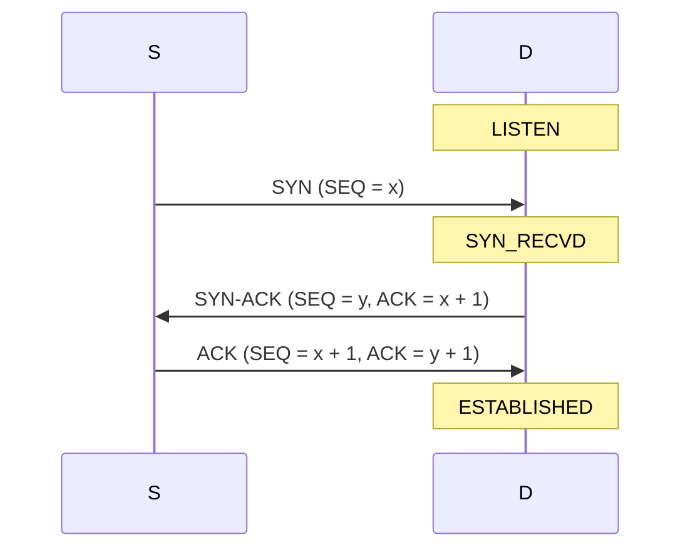
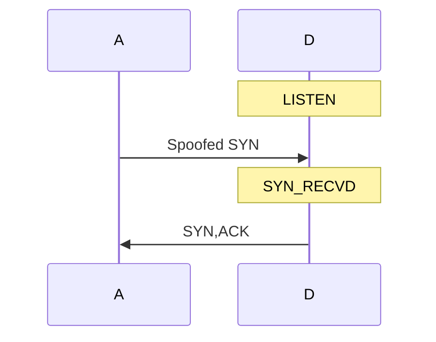
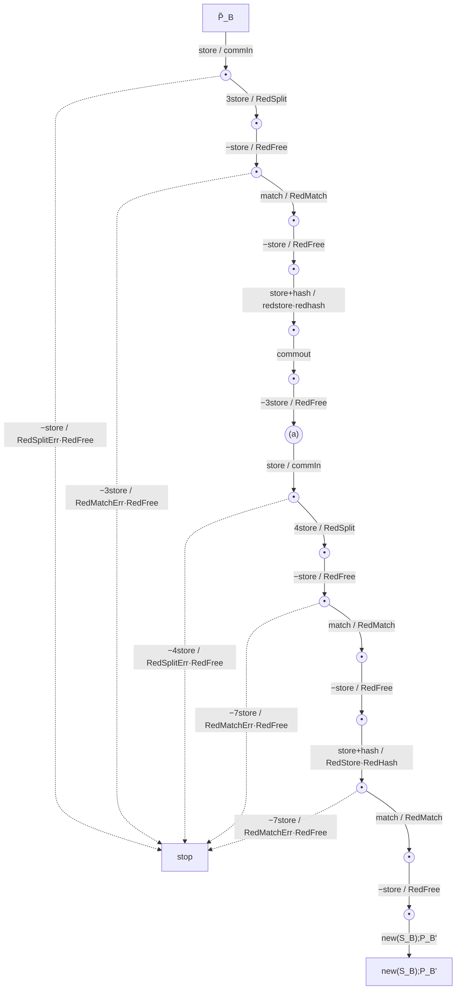

# 通信プロトコルにおけるサービス不能攻撃耐性解析のための型付き π 計算

> **この Markdown について**
> `png/01.png`〜`png/19.png`（`spice-jssst.pdf` の各ページ、200 DPI）を読み取って作成した転記版です。
> 数式は **MathJax** での表示を前提としています。推論規則・推導木は `\frac` ではなく **bussproofs** パッケージの `prooftree` 環境で記述しています。
>
> MathJax で表示する場合は `bussproofs` 拡張を有効にしてください：
>
> ```js
> window.MathJax = {
>   loader: { load: ['[tex]/bussproofs'] },
>   tex: { packages: { '[+]': ['bussproofs'] } }
> };
> ```
>
> プロトコル図・遷移図は Mermaid で記述しています（GitHub ではそのまま描画されます）。
>
> 記法対応：型付け判定 $A \triangleright P$ ／ 簡約関係 $P > Q : c$ ／ 複簡約関係 $A \vdash P \gg Q : \sigma$ ／ コミットメント関係 $A \vdash P \overset{\alpha}{\mapsto} A' : \sigma$ ／ 複コミットメント関係 $A \vdash P \longrightarrow P' : \sigma$


**Typed pi-calculus for analysis of resistance against denial-of-service attacks in communication protocols**

富岡大悟　池田立野　西崎真也

東京工業大学大学院情報理工学研究科／Department of Computer Science, Tokyo Institute of Technology

*コンピュータソフトウェア, Vol.23, No.3 (2006), pp.66–84.*
*［論文］2004 年 7 月 12 日受付*

---

## 概要

通信プロトコルの安全性、特に認証プロトコルにおける認証の正当性に関する研究は、Abadi や Gordon による spi 計算 (secure pi-calculus) などをはじめとして、近年さかんに行なわれている。プロトコルにおける安全性は、認証の正当性や機密性などの他に、最近では、サービス不能攻撃 (Denial-of-Service attack) 耐性が重要視される。もっとも典型的な攻撃例としては、TCP の 3 ウェイハンドシェイクにおける SYN あふれ攻撃 (SYN-flooding attack) が知られている。プロトコルのサービス不能攻撃耐性を形式的に扱う枠組みとしては、メドーズらにより提唱された、コスト情報を付記したアリス・ボブ記法があった。この他に、最近、富岡らにより提唱された spice 計算 [13] がある。spice 計算は、spi 計算を拡張したもので、プロセスの計算における計算コストが、サーバーやクライアントの計算機において、どのように費されるかを明示的に表現できるように、システムにおける計算機構成を型として形式化した。そして、書き換えスタイルの操作的意味論があたえられており、プロセスに対する型付けの情報を利用することにより、計算の進行における計算コストを区別するようになっている。記憶コストは、サービス不能攻撃耐性を測る場合、各種の計算コストのうちで最も重要となるのだが、spice 計算では、記憶領域の解放を明示的に行なうようにした。本研究では、従来の spice 計算における型体系と操作的意味論を、計算機ごとの記憶コストの見積りに併せて、記憶領域の解放に関する正当性を保証するように、改良した。また、SYN あふれ攻撃とその防御策である SYN クッキーが形式化できることを適用例として紹介する。

## Abstract

Security on communication protocols, especially authentication protocols, has been studied by many researchers, for example, the secure pi-calculus by Abadi and Gordon. Resistance against the denial-of-service attack is one of the important issues of secure protocols as secrecy and authenticity. A typical example of the denial-of-service attack is TCP SYN-flooding attack. Meadows proposed an Alice-and-Bob notation annotated with cost description as a formal framework for analyzing resistance against denial-of-service attacks. In this paper, we proposed the spice-calculus, which is an extended secure pi-calculus by adding explicit description on computation costs. We give operational semantics and a type system to the spice-calculus; the typing represents configuration of network system. We then investigate theoretical properties on the type system, e.g. subject reduction. We present formalization of TCP SYN flooding attack and its protection method, SYN-cookie, on the typed spice-calculus as examples.

---

## 1 はじめに

### 1.1 サービス不能攻撃

サービス不能攻撃 (Denial-of-Service attack, DoS attack) は、ソフトウェアにおける安全性をおびやかす典型的なものであり、正規のユーザーが計算機やネットワークの使用を不可能においこむような攻撃である。典型的な DoS 攻撃の例としては、TCP における SYN あふれ攻撃 (SYN flooding attack) [12] があげられる。

**サービス不能攻撃の例：SYN あふれ攻撃**

TCP の通信においては、3 ウェイハンドシェイクと呼ばれるプロトコルに基づいて接続が確立される。接続元を $S$ とし、接続先を $D$ とする。

1. まず、$S$ は SYN と呼ばれるパケットを $D$ に送る。SYN パケットには、初期シーケンス番号 $x$ が含まれる。シーケンス番号 (sequence number, SEQ) とは、一連のデータ送信において、どこまでデータを送信したのかを表わす数であり、初期シーケンス番号はその初期値であり、一般にランダムに決められる。

2. 次に、接続先 $D$ が接続を許可する場合は、SYN-ACK と呼ばれるパケットを $S$ に返す。このパケットには、$D$ から $S$ への一連の通信に対する初期シーケンス番号 $y$ の他、$S$ から $D$ への通信に対する応答確認番号 (acknowledgement number, ACK) が含まれる。この応答確認番号は、$S$ から $D$ へ流れるデータに対する初期シーケンス番号 $x$ に 1 を加えた数となっている。$D$ は、接続元のアドレス・ポート番号やシーケンス番号など、確立しようとする接続に関する情報を記憶しておかなければならない。

3. SYN-ACK パケットを接続元 $S$ が受けとると、$S$ は $D$ に ACK パケットを送信する。この中には、シーケンス番号として $x+1$、応答確認番号として $y+1$ が含まれている。$D$ は、記憶しておいたこの接続に関する情報と ACK パケットの情報とを比較しチェックする。$D$ は SYN-ACK パケットを送出後、$S$ からの ACK パケットを一定時間待つ。



もし、攻撃者 $A$ がアドレスを偽装し送信元アドレスを変えつつ、SYN パケットを送ったとする。そうすると、$D$ は SYN-ACK パケットを擬装された送信元に対して送信し、一定時間その ACK パケットの返信を待つ。しかしながら、その擬装された送信元からの返信はない。もし短時間にこのような擬装された SYN パケットが多量に送信されるとすると、$D$ における接続情報を格納する記憶領域があふれ、TCP のサービスが停止することとなる。これが、SYN あふれ攻撃である。



SYN cookie など、SYN あふれ攻撃にはさまざまな対策 [12] が提唱されている。

### 1.2 サービス不能攻撃の形式化

サービス不能攻撃は、さまざまな側面から研究が進んでおり、例えば、資源管理によるサービス不能攻撃からの防御 [10] や、プロトコルにおけるサービス不能攻撃耐性の向上 [3] [4] などの研究がある。また、メドーズは、サービス不能攻撃耐性を解析するための形式的体系 [8] [9] を提唱した。この形式的体系は、アリス・ボブ記法 (Alice-and-Bob notation) に計算コストに関する情報を付記するという拡張を行なっている。論文 [8] では、ディフィー・ヘルマンのプロトコルの一種である STS プロトコル (Station-to-Station protocol) を例にあげている。

1. $A \rightarrow B: \quad \alpha^{X_A}$
2. $B \rightarrow A: \quad \alpha^{X_B}, E_K(S_B(\alpha^{X_B}, \alpha^{X_A}))$
3. $A \rightarrow B: \quad E_K(S_A(\alpha^{X_A}, \alpha^{X_B}))$,

但し、$\alpha$ は、$A$ と $B$ が共有する素数 $p$ の原始根であり、$X_A$ と $X_B$ は、$A$ と $B$ のそれぞれがもつ秘密情報である。$K$ はディフィー・ヘルマンの共有鍵 $\alpha^{X_A X_B}$ である。$E_K$ は共有鍵 $K$ による暗号化関数を表し、$S_A$ と $S_B$ は、それぞれ $A$ による署名、$B$ による署名を表す。メドーズはこれに対して、各ステップにおける処理に関する記述を付ける。

1. $A \rightarrow B: \quad preexp_1, storename_1 \parallel \alpha^{X_A} \parallel storenonce_1, storename_2, accept_1$
2. $B \rightarrow A: \quad preexp_2, sign_1, exp_1, encrypt_1 \parallel \alpha^{X_B}, E_K(S_B(\alpha^{X_B}, \alpha^{X_A})), exp_2, checkname_1, retrieveonce_1, decrypt_1, checksig_1, accept_2$
3. $A \rightarrow B: \quad sign_2, encrypt_2 \parallel E_K(S_A(\alpha^{X_A}, \alpha^{X_B})) \quad checkname_2, retrieveonce_2, decrypt_2, checksig_2, accept_4$.

但し、処理 $preexp$ は、静的に底がわかっている場合のべき乗であり、$exp$ は底が動的にしかわからない場合のべき乗である。処理 $storename$ と $storenonce$ は各々、名前の保存、ナンスの保存を意味する。

プロトコルの進行においてこれらの処理がどのようになされるかを追跡することにより、各プロセスの処理コストを計算する。例えば、攻撃者 $I$ が $B$ に対して、ランダムにでたらめな内容をもつメッセージを送信した場合には、被攻撃者 $B$ は以下のような処理を実行しなければならなくなる。

$$storenonce_1, storename_2, accept_1, preexp_2, sign_1, exp_1, encrypt_1.$$

この体系では、各処理に対してコストが割り当てられており、この場合、処理 $sign$ や処理 $exp$ には、コスト $expensive$ が割り当てられ、処理 $preexp$ や処理 $encrypt$ には、コスト $intermediate$ が割り当てられ、$storenonce$ や $storename$ にはコスト $cheap$ が割当てられている。実行される処理の列から、コストの総計を計算すると、

$$2expensive + 2medium + 2cheap,$$

となる。これにより、被攻撃者 $B$ が要するコストが、攻撃者の要するコスト (ランダムなメッセージを生成・送信) より明らかに高価であることがわかる。

### 1.3 動機

メドーズの体系は、サービス不能攻撃体制の解析のための最初の形式的枠組みであり、アリス・ボブ記法に基づいていて理解しやすいという利点をもつ。しかしながら、メドーズのコスト解析は、プロトコル記述に対する処理に関する付記に基づいており、どのように処理を付記するのかはプロトコル記述を行なう者の責任となる。もし、処理の付記を間違えれば、コスト解析も誤った結果となる。しかし、プロトコルの進行において行われている処理は、本質的には、プロトコルのメッセージ仕様自体に非明示的であるものであり、記述されている。そこで、われわれは、プロトコルの操作的意味に基づくコスト計算を行なうことが可能となるようなプロトコル記述体系を確立することを目指す。

安全プロトコル記述体系として、例えば、spi 計算 (secure pi-calculus, spi-calculus) [1] [2] [16] がアバディとゴードンにより、提唱されている。ゴードンとジェフリーは、この spi 計算を用いた型理論的な手法 [5] [6] [7] で、認証性の検証手法を提唱している。

論文 [13] では、spi 計算に対してコスト計測の機構を拡張し、サービス拒否攻撃を記述・解析することを可能とする形式的体系 spice 計算 (secure pi-calculus for cost estimation) を提唱した。この体系は、spi 計算を拡張したもので、プロセスの計算における計算コストが、サーバーやクライアントの計算機において、どのように費されるかを明示的に表現できるように、システムにおける計算機構成を型として形式化した。書き換えスタイルで操作的意味論をあたえ、プロセスに対する型付けの情報を利用することにより、計算の進行における計算コストを区別するようになっている。記憶コストは、サービス不能攻撃耐性を測る場合、各種の計算コストのうちで最も重要となるのだが、spice 計算では、記憶領域の解放を明示的に行なうようにした。本論文では、従来の spice 計算における型体系と操作的意味論を、計算機ごとの記憶コストの見積りに併せて、記憶領域の解放に関する正当性を保証するように、改良した。

以下では、spice 計算の構文と操作的意味論を紹介した後、型体系を与える。そして、記憶コスト健全性、すなわち、記憶コストが通算すると負にならないという性質を示す。最後に、SYN あふれ攻撃とその防御策である SYN クッキーが形式化できることを適用例として紹介する。

---

## 2 コスト解析のための体系

名前の可算集合 $\mathcal{N}$ と変数の可算集合 $\mathcal{V}$ が与えられているとする。名前と変数から、まず、値と呼ばれる構文を定義し、それを拡大した構文として、項を定義する。

**定義 1 (項と値)**　値は以下のように帰納的に定義される。

$$V, U, W \ ::= \quad \begin{array}[t]{ll}
n & \text{名前} \\
x & \text{変数} \\
i & \text{整数} \\
(V_1, \ldots, V_n) & \text{対値} \\
\mathit{hashv} & \text{ハッシュ値}
\end{array}$$

そして、項は以下のように帰納的に定義される。

$$M, N \ ::= \quad \begin{array}[t]{ll}
V & \text{値} \\
(M + N) & \text{加法} \\
[M_1, \ldots, M_n] & \text{対式} \\
\mathit{hash}(M) & \text{ハッシュ式}
\end{array}$$

ハッシュに対して、値と式が両方定義されているが、式は評価前の構文を表し、値は評価後の結果であるデータを表す。次にプロセスと呼ばれる構文を定義する。名前はプロセス間通信の際のポート名を表す。変数は、データを格納する領域を表す。対式は、メッセージ列を表現するのに用いられる。

**定義 2 (プロセス)**　プロセス (process) は以下のように定義される。

$$P, Q, R \ ::= \quad \begin{array}[t]{ll}
\mathtt{out}\ M_{port}\, \langle N_{msg} \rangle ; P & \text{出力} \\
\mathtt{inp}\ M_{port}\, (x) ; P & \text{入力} \\
(P \mid Q) & \text{合成} \\
\mathtt{new}(n) ; P & \text{名前制限} \\
\mathtt{repeat}\ P & \text{複製} \\
\mathtt{stop} & \text{空} \\
\mathtt{store}\ x = M ; P & \text{記憶割り当て} \\
\mathtt{free}\ x ; P & \text{記憶解放} \\
\mathtt{match}\ M\ \mathtt{is}\ N\ \mathtt{err}\{P\} ; Q & \text{マッチング} \\
\mathtt{split}\ [x_1, \ldots, x_n]\ \mathtt{is}\ M\ \mathtt{err}\{R\} ; P &
\end{array}$$

出力 (プロセス) は、第一引数 $M_{port}$ が通信ポート名、第二引数 $N_{msg}$ が送信メッセージ、第三引数 $P$ が継続されるプロセスを表す。入力 (プロセス) は、第一引数 $M_{port}$ が通信ポート名、第二引数で与えられる変数 $x$ が受信メッセージを格納する変数、第三引数 $P$ が継続されるプロセスを表す。合成は並列実行を表す。名前制限は新しい名前の生成を表す。複製は、プロセスの複製の生成を表す。記憶割り当ては記憶領域の新規割り当てを表し、記憶解放は、割り当てられた記憶の解放を表す。記憶領域の新規割り当ては、記憶割り当ての他、入力や対分解で行なわれる。

論文 [13] でおこなったように、暗号化、復号化、署名なども同様に定義できるが、後で利用しないので本論文では議論しない。

変数を束縛するものとして、入力、対分解、記憶割り当てがある。束縛されない変数を自由変数と呼ぶ。一方、名前を束縛するのは名前制限である。束縛されない名前を自由名前と呼ぶ。形式的には、以下のように定義される。

**定義 3 (自由変数)**　プロセス $P$ における自由変数の集合 $fv(P)$ は、以下のように帰納的に定義される。

$$
\begin{array}{rcl}
fv(\mathtt{out}\ M\ \langle N \rangle ; P) & = & fv(M) \cup fv(N) \cup fv(P), \\
fv(\mathtt{inp}\ M\ (x) ; P) & = & fv(M) \cup fv(P) \setminus \{x\}, \\
fv(P \mid Q) & = & fv(P) \cup fv(Q), \\
fv(\mathtt{new}(n) ; P) & = & fv(P), \\
fv(\mathtt{repeat}\ P) & = & fv(P), \\
fv(\mathtt{stop}) & = & \emptyset, \\
fv(\mathtt{store}\ x = M ; P) & = & fv(M) \cup fv(P) \setminus \{x\}, \\
fv(\mathtt{free}\ x ; P) & = & fv(P),
\end{array}
$$

$$
\begin{array}{rcl}
fv(\mathtt{match}\ M\ \mathtt{is}\ N\ \mathtt{err}\{P\} ; Q) & = & fv(M) \cup fv(N) \cup fv(P) \cup fv(Q), \\
fv(\mathtt{split}\ [x_1, \ldots, x_n]\ \mathtt{is}\ M\ \mathtt{err}\{R\} ; P) & = & fv(M) \cup (fv(P) \setminus \{x_1, \ldots, x_n\}) \cup fv(R),
\end{array}
$$

ただし、項 $M$ 中の自由変数の集合 $fv(M)$ は、項 $M$ に出現する変数すべての集合として定義する。spice 計算では、変数を束縛するのは、入力、対分解、記憶割り当てである。

**定義 4 (自由名前)**　プロセス $P$ の自由名前の集合 $fn(P)$ は以下のように帰納的に定義される。制限プロセスに対しては、

$$fn(\mathtt{new}(n) ; P) = fn(P) \setminus \{n\}$$

と定義される。その他のプロセスについては、似かよったものとなる。例えば、出力、合成、対分解に対しては以下のように定義される。

$$
\begin{array}{rcl}
fn(\mathtt{out}\ M\ \langle N \rangle ; P) & = & fn(M) \cup fn(N) \cup fn(P), \\
fn(P \mid Q) & = & fn(P) \cup fn(Q), \\
fn(\mathtt{split}\ [x_1, \ldots, x_n]\ \mathtt{is}\ M\ \mathtt{err}\{R\} ; P) & = & fn(M) \cup fn(P) \cup fn(R),
\end{array}
$$

ただし、項 $M$ に対する自由名前の集合 $fn(M)$ は、項 $M$ に出現する名前すべての集合として定義される。spice 計算で、名前に対して束縛するのは制限 $\mathtt{new}(n)$ のみである。

pi 計算の操作的意味論 [11] には、反応規則 (reaction rule) に基づくものと、ラベル付き遷移関係を拡張したコミットメント規則 (commitment rule) に基づくものがある。本論文で与える Spice 計算はコミットメント規則に基づく操作的意味論を拡張する。そのために、エージェントと呼ばれる構文を定義する。これらを直感的に説明すると、出力プロセスや入力プロセスが、送信シグナルや受信シグナルを送出した後、メッセージが変数に代入されるまでの中間状態を表す。

**定義 5 (エージェント)**　エージェント (agent) は以下のように定義される。

$$A, B \ ::= \quad \begin{array}[t]{ll}
P & \text{プロセス} \\
(x)P & \text{抽象化} \\
(\nu n_1 \cdots n_j)\langle M \rangle P & \text{具体化}
\end{array}$$

抽象化 $(x)P$ を表すメタ変数として、$F, F', \ldots$ を用い、具体化 $(\nu n_1 \cdots n_j)\langle M \rangle P$ を表すメタ変数として、$C, C', \ldots$ を用いる。

プロセスと同様に、エージェントに対して、名前制限 $\mathtt{new}(n) ; A$ と合成 $A \mid B$ を定義する。これらは共に、いわゆる「マクロ」である。

**定義 6 (エージェント上の名前制限)**　エージェント上の名前制限は以下の等式により帰納的に定義される。

$$\mathtt{new}(n) ; (x)P \equiv (x)(\mathtt{new}(n) ; P),$$

$\{n_1, \ldots, n_j\}$ をみたす名前 $n$ に対して、

$$
\begin{array}{rcl}
\mathtt{new}(n) ; ((\nu n_1 \cdots n_j)\langle M \rangle P) & \equiv & (\nu n\, n_1 \cdots n_j)\langle M \rangle P \quad (n \notin fn(M)\ \text{のとき}) \\
& \equiv & (\nu n_1 \cdots n_j)\langle M \rangle \mathtt{new}(n) ; P \quad (\text{その他})
\end{array}
$$

**定義 7 (エージェント上の合成)**　エージェント上の合成は以下の等式により帰納的に定義される。

$x \notin fv(R)$ をみたすとき

$$
\begin{array}{rcl}
R \mid ((x)P) & \equiv & (x)(R \mid P) \\
((x)P) \mid R & \equiv & (x)(P \mid R)
\end{array}
$$

$\{n_1, \ldots, n_j\} \cap fn(P) = \emptyset$ をみたすとき

$$
\begin{array}{rcl}
((\nu n_1 \cdots n_j)\langle M \rangle R) \mid P & \equiv & (\nu n_1 \cdots n_j)\langle M \rangle (R \mid P) \\
P \mid ((\nu n_1 \cdots n_j)\langle M \rangle R) & \equiv & (\nu n_1 \cdots n_j)\langle M \rangle (P \mid R)
\end{array}
$$

次に型を定義する。変数の集合の他、計算機名の集合があらかじめ与えられていると仮定する。計算機名を表すメタ変数として、$\mathbf{a}, \mathbf{b}, \mathbf{c}$ などを使用する。

**定義 8 (型)**　型は次のように帰納的に定義される。

$$A, B \ ::= \quad \begin{array}[t]{ll}
\mathbf{a}::\{x_1, \ldots, x_n\} & \text{計算機型} \\
(A \mid B) & \text{合成型}
\end{array}$$

以下では、$\mathcal{V}, \mathcal{V}'$ などは変数の有限集合を表すこととする。型 $A$ に出現する変数全体の集合を $var(A)$ と表し、以下のように帰納的に定義される。

$$
\begin{array}{rcl}
var(\mathbf{a}::\mathcal{V}) & = & \mathcal{V} \\
var(A \mid B) & = & var(A) \cup var(B)
\end{array}
$$

計算機型 $\mathbf{a}::\{x_1, \ldots, x_n\}$ は、現在変数 $x_1, \ldots, x_n$ が割当てられている計算機 $\mathbf{a}$ を表し、合成 $(A \mid B)$ は、計算機 $A$ と $B$ の並列合成、すなわち、$A$ と $B$ との仮想的な並列計算機を表している。

Spice 計算の型付けは、大まかに分けて以下のような二つの役割がある。

**計算コストの発生源追跡のための目印**　プロセスの実行過程において、計算コストがどの計算機で発生したかを追跡するために、プロセスのどの部分がどの計算機で実行されるのかを、型付けにより記述する。

**各計算機上で割り当てられる変数の制御**　Spice 計算においては変数の割り当てを制御することにより、割り当てられていない記憶に対する記憶解放を制限する。

型付けは、以下で定義される型付け判定式 (typing judgement) $A \triangleright P$ により与えられる。これはプロセス $P$ が型 $A$ が表す計算機上で実行されるということを意味する。たとえば、$(\mathbf{a}::\{x, y\} \mid \mathbf{b}::\{z\}) \triangleright (P \mid Q)$ は、計算機 $\mathbf{a}$ に変数 $x, y$ が割り当てられていて、計算機 $\mathbf{b}$ に変数 $z$ が割り当てられていて、プロセス $P$ はそのような状態の計算機 $\mathbf{a}$ 上で実行可能であり、$Q$ はそのような状態の $\mathbf{b}$ 上で実行可能であることを表す。

**定義 9 (型付け判定式, 型付け規則)**　型付け判定式は、型 $A$ とエージェント $A$ との間の二項関係であり、$A \triangleright P$ と書き、以下の型付け規則により帰納的に定義される。

**TypeOut**

$$\begin{prooftree}
\AxiomC{$\mathbf{a}::\mathcal{V} \triangleright P$}
\AxiomC{$\mathcal{V} \supseteq fv(M)$}
\AxiomC{$\mathcal{V} \supseteq fv(N)$}
\TrinaryInfC{$\mathbf{a}::\mathcal{V} \triangleright \mathtt{out}\ M\ \langle N \rangle ; P$}
\end{prooftree}$$

**TypeInp**

$$\begin{prooftree}
\AxiomC{$\mathbf{a}::(\{x\} \cup \mathcal{V}) \triangleright P$}
\AxiomC{$\mathcal{V} \not\ni x$}
\AxiomC{$\mathcal{V} \supseteq fv(M)$}
\TrinaryInfC{$\mathbf{a}::\mathcal{V} \triangleright \mathtt{inp}\ M\ (x) ; P$}
\end{prooftree}$$

入力プロセスの $\mathtt{inp}\ M\ (x) ; P$ の型とその部分プロセス $P$ の型を比較すると、変数 $x$ が追加されている点が異なるが、これは、プロセス $P$ の実行が開始される時点で、変数 $x$ が割当てられていることを意味している。

**TypeComp**

$$\begin{prooftree}
\AxiomC{$A \triangleright P$}
\AxiomC{$B \triangleright Q$}
\BinaryInfC{$(A \mid B) \triangleright (P \mid Q)$}
\end{prooftree}$$

**TypeRestr**

$$\begin{prooftree}
\AxiomC{$A \triangleright P$}
\UnaryInfC{$A \triangleright \mathtt{new}(n) ; P$}
\end{prooftree}$$

**TypeRepl**

$$\begin{prooftree}
\AxiomC{$\mathbf{a}::\emptyset \triangleright P$}
\UnaryInfC{$\mathbf{a}::\emptyset \triangleright \mathtt{repeat}\ P$}
\end{prooftree}$$

この規則は、プロセスの複製は変数が割当てられていない状態の計算機上でのみ許されることを意味している。この制限により、プロセスの複製が実行されるときには、変数の格納領域は空になっていて、このとき、変数領域の複製は引き起されない。このように定義した理由は、プロセス複製のコスト付けを単純化するためである。

**TypeNil**

$$\begin{prooftree}
\AxiomC{}
\UnaryInfC{$\mathbf{a}::\emptyset \triangleright \mathtt{stop}$}
\end{prooftree}$$

この規則は、プロセス正常終了時には、変数が割当てられていない状態でなければならないことを意味している。すなわち、この規則は、正常終了するときには、割当てられた記憶領域はすべて、$\mathtt{free}$ で開放されることを強制している。

**TypeStore**

$$\begin{prooftree}
\AxiomC{$\mathbf{a}::(\{x\} \cup \mathcal{V}) \triangleright P$}
\AxiomC{$\mathcal{V} \not\ni x$}
\AxiomC{$\mathcal{V} \supseteq fv(M)$}
\TrinaryInfC{$\mathbf{a}::\mathcal{V} \triangleright \mathtt{store}\ x = M ; P$}
\end{prooftree}$$

**TypeFree**

$$\begin{prooftree}
\AxiomC{$\mathbf{a}::\mathcal{V} \triangleright P$}
\AxiomC{$\mathcal{V} \not\ni x$}
\BinaryInfC{$\mathbf{a}::(\{x\} \cup \mathcal{V}) \triangleright \mathtt{free}\ x ; P$}
\end{prooftree}$$

**TypeMatch**

$$\begin{prooftree}
\AxiomC{$\mathbf{a}::\mathcal{V} \triangleright P$}
\AxiomC{$\mathbf{a}::\mathcal{V} \triangleright Q$}
\AxiomC{$\mathcal{V} \supseteq fv(M)$}
\AxiomC{$\mathcal{V} \supseteq fv(N)$}
\QuaternaryInfC{$\mathbf{a}::\mathcal{V} \triangleright \mathtt{match}\ M\ \mathtt{is}\ N\ \mathtt{err}\{P\} ; Q$}
\end{prooftree}$$

**TypeSplit**

$$\begin{prooftree}
\AxiomC{$\mathbf{a}::(\{x_1, \ldots, x_n\} \cup \mathcal{V}) \triangleright P$}
\AxiomC{$\mathbf{a}::\mathcal{V} \triangleright R$}
\AxiomC{$\{x_1, \ldots, x_n\} \cap \mathcal{V} = \emptyset$}
\AxiomC{$\mathcal{V} \supseteq fv(M)$}
\QuaternaryInfC{$\mathbf{a}::\mathcal{V} \triangleright \mathtt{split}\ [x_1, \ldots, x_n]\ \mathtt{is}\ M\ \mathtt{err}\{R\} ; P$}
\end{prooftree}$$

**TypeAbstr**

$$\begin{prooftree}
\AxiomC{$A \triangleright P$}
\UnaryInfC{$A \triangleright (x)P$}
\end{prooftree}$$

**TypeConcr**

$$\begin{prooftree}
\AxiomC{$A \triangleright P$}
\AxiomC{$fv(M) = \emptyset$}
\BinaryInfC{$A \triangleright (\nu n_1 \cdots n_j)\langle M \rangle P$}
\end{prooftree}$$

式 $M$ には自由変数が含まれていないことが条件になっている。後述の操作的意味論からわかるように、この具体化エージェントが発生するときには、実際には、式 $M$ は、自由変数を含まないような値となる。

例えば、プロセス

$$\mathtt{inp}\ n\ (x) ; \mathtt{out}\ n\ \langle x+1 \rangle ; \mathtt{stop}$$

は通信ポート $n$ から整数を受信し、それに 1 をたしたものを、そのポートから送信して、停止するという処理を行う。変数 $x$ を解放していないので、このプロセスには型が付かない。実際、

$$\mathbf{a}::\mathcal{V} \triangleright \mathtt{inp}\ n\ (x) ; \mathtt{out}\ n\ \langle x+1 \rangle ; \mathtt{stop}$$

であると仮定する。型付け規則 **TypeInp** により、

$$\mathbf{a}::\{x\} \cup \mathcal{V} \triangleright \mathtt{out}\ n\ \langle x+1 \rangle ; \mathtt{stop}$$

でなければならず、型付け規則 **TypeOut** により、

$$\mathbf{a}::\{x\} \cup \mathcal{V} \triangleright \mathtt{stop}$$

が成り立たなければならないことになるが、これは型付け規則 **TypeNil** に矛盾する。一方、停止直前に変数 $x$ を解放すれば型は付く。

$$\mathbf{a}::\emptyset \triangleright \mathtt{inp}\ n\ (x) ; \mathtt{out}\ n\ \langle x+1 \rangle ; \mathtt{free}\ x ; \mathtt{stop}$$

ここで与える型付けの導出木はプロセスに対して一意的に定まる。

**命題 1**　プロセス $P$ に対して、型付け可能ならば、型付けを導く導出木は一意的である。

この命題は型付けの導出木の構造に関する帰納法により容易に証明される。

エージェントに対する名前制限 $\mathtt{new}(n) ; A$、合成 $(A \mid B)$ に対しても、型付け規則 **TypeRestr**, **TypeComp** と同等の性質が成り立つ。

**命題 2**
1. $A \triangleright A$ ならば $A \triangleright \mathtt{new}(n) ; A$.
2. $A \triangleright A$ かつ $B \triangleright B$ ならば、$(A \mid B) \triangleright (A \mid B)$.

変数情報は無視して、同一の計算機同士の合成は一つの計算機と同一視するというのが、以下の型同値である。

**定義 10 (型同値)**　型の間の二項関係 $A \simeq B$ を以下の規則から帰納的に定義する。

$$\begin{prooftree}
\AxiomC{}
\UnaryInfC{$\mathbf{a}::\mathcal{V} \simeq \mathbf{a}::\mathcal{W}$}
\end{prooftree}$$

$$\begin{prooftree}
\AxiomC{}
\UnaryInfC{$(\mathbf{a}::\mathcal{V}) \mid \mathbf{a}::\mathcal{W} \simeq \mathbf{a}::\mathcal{X}$}
\end{prooftree}$$

$$\begin{prooftree}
\AxiomC{}
\UnaryInfC{$A \simeq A$}
\end{prooftree}$$

$$\begin{prooftree}
\AxiomC{$A \simeq A'$}
\UnaryInfC{$(A \mid B) \simeq (A' \mid B)$}
\end{prooftree}$$

$$\begin{prooftree}
\AxiomC{$B \simeq B'$}
\UnaryInfC{$(A \mid B) \simeq (A \mid B')$}
\end{prooftree}$$
### 2.1 コスト

コストは、数値や Meadows [8] [9] のように順序集合の元として定義することも考えられるが、本論文では、各種の処理を何回行なったかということを表す式を導入する。

コスト基底は、コストの種類を表す最小単位である。

**定義 11 (コスト基底)**　コスト基底 (cost base) として、本論文では以下のものを用いる。$\mathbf{u}, \mathbf{v}, \mathbf{w}$ をメタ変数として用いる。

$$\mathit{store}_x\ (\text{変数 } x \text{ への記憶}), \quad \mathit{pair}\ (\text{対生成}), \quad \mathit{hash}\ (\text{ハッシュ値の計算}), \quad \mathit{match}\ (\text{マッチング}), \quad \mathit{repeat}\ (\text{プロセス複製}).$$

**定義 12 (コスト値)**　コスト値 (cost value) は、コスト基底を整数係数で線型結合したものである。すなわち、$\mathbf{u}_1, \ldots, \mathbf{u}_j$ をコスト基底とし、$n_1, \ldots, n_j$ を整数とするならば、

$$n_1 \mathbf{u}_1 + \cdots + n_j \mathbf{u}_j$$

はコスト値となる。コスト値の集合は、コスト基底により自由生成された加法群である。

**定義 13 (コスト割り当て)**　コスト割り当ては、型とコストの対の有限集合である。すなわち、$\mathbf{a}_1, \ldots, \mathbf{a}_n$ を計算機名、$c_1, \ldots, c_n$ をコスト値とすると、コスト割り当ては次のように書かれる。

$$\{\mathbf{a}_1 \cdot c_1, \ldots, \mathbf{a}_n \cdot c_n\}.$$

コスト値の (ラベル付き) 直積とみなして、コスト割り当てにも加法が導入される。例えば、

$$
\{\mathbf{a} \cdot (2\mathit{pair} + \mathit{hash}), \mathbf{b} \cdot \mathit{match}\} + \{\mathbf{a} \cdot (\mathit{pair} + 3\mathit{hash}), \mathbf{b} \cdot \mathit{enc}\}
= \{\mathbf{a} \cdot (3\mathit{pair} + 4\mathit{hash}), \mathbf{b} \cdot (\mathit{match} + \mathit{enc})\}
$$

次に項に対する評価を定義する。これは、項に関する計算を形式化したものである。

**定義 14 (項の評価)**　項の評価 $M \downarrow V : c$ は、項 $M$, 値 $V$, コスト値 $c$ との間の三項関係であり、以下の規則によって定義される。

$$\begin{prooftree}
\AxiomC{}
\UnaryInfC{$V \downarrow V : c$}
\end{prooftree}$$

$$\begin{prooftree}
\AxiomC{$M_1 \downarrow i_1 : c_1$}
\AxiomC{$M_2 \downarrow i_2 : c_2$}
\BinaryInfC{$(M_1 + M_2) \downarrow (i_1 + i_2) : c_1 + c_2$}
\end{prooftree}$$

$$\begin{prooftree}
\AxiomC{$M_1 \downarrow V_1 : c_1$}
\AxiomC{$\cdots$}
\AxiomC{$M_n \downarrow V_n : c_n$}
\TrinaryInfC{$[M_1, \ldots, M_n] \downarrow (V_1, \ldots, V_n) : c_1 + \cdots + c_n + \mathit{pair}$}
\end{prooftree}$$

$$\begin{prooftree}
\AxiomC{$M \downarrow V : c$}
\UnaryInfC{$\mathit{hash}(M) \downarrow \mathit{hashv} : c + \mathit{hash}$}
\end{prooftree}$$

次にプロセスの簡約関係を定義する。これは、同一の計算機で実行される計算を定式化したものである。spi 計算と spice 計算とで最も異なるのは、変数の機構である。spice 計算では、変数の解放を明示的に書くことを要求する。それにより、詳細な記憶コストの解析が可能となっている。変数の参照機構は、λ計算や pi 計算では、代入により形式化されている。例えば、プロセス $\mathtt{free}\ x ; P$ が変数 $x$ に値 $V$ が束縛されている状態で実行されるという状況を考えよう。変数 $x$ の解放された後のプロセス $P$ においては、この束縛 $x \mapsto V$ は有効ではない。したがって、代入 $[V/x]$ も、$P$ には適用されるべきではない。このことを踏まえると以下のように代入は形式的に定義される。

**定義 15 (代入)**　プロセス $P$ における変数 $x$ に対する項 $L$ の代入 $P[L/x]$ は以下のように帰納的に定義される。

$$
\begin{array}{rcl}
(\mathtt{out}\ M\ \langle N \rangle ; P)[L/x] & = & \mathtt{out}\ M[L/x]\ \langle N[L/x] \rangle ; P[L/x] \\
(\mathtt{inp}\ M\ (x) ; P)[L/x] & = & \mathtt{inp}\ M[L/x]\ (x) ; P \\
(\mathtt{inp}\ M\ (y) ; P)[L/x] & = & \mathtt{inp}\ M[L/x]\ (y) ; P[L/x] \\
(P \mid Q)[L/x] & = & P[L/x] \mid Q[L/x] \\
(\mathtt{new}(n) ; P)[L/x] & = & \mathtt{new}(n) ; P[L/x] \\
(\mathtt{repeat}\ P)[L/x] & = & \mathtt{repeat}\ P[L/x] \\
\mathtt{stop}[L/x] & = & \mathtt{stop} \\
(\mathtt{match}\ M\ \mathtt{is}\ N\ \mathtt{err}\{P\} ; Q)[L/x] & = & \mathtt{match}\ M[L/x]\ \mathtt{is}\ N[L/x]\ \mathtt{err}\{P[L/x]\} ; Q[L/x] \\
(\mathtt{split}\ [x_1, \ldots, x_n]\ \mathtt{is}\ M\ \mathtt{err}\{R\} ; P)[L/x] & = & \mathtt{split}\ [x_1, \ldots, x_n]\ \mathtt{is}\ M[L/x]\ \mathtt{err}\{R[L/x]\} ; P[L/x]
\end{array}
$$

$$
\begin{array}{rcl}
(\mathtt{decrypt}\ M\ \mathtt{is}\ enc(x', N)\ \mathtt{err}\{R\} ; P)[L/x] & = & \mathtt{decrypt}\ M[L/x]\ \mathtt{is}\ enc(x', N[L/x])\ \mathtt{err}\{R[L/x]\} ; P[L/x] \\
(\mathtt{decrypt}\ M\ \mathtt{is}\ pubenc(x', N)\ \mathtt{err}\{R\} ; P)[L/x] & = & \mathtt{decrypt}\ M[L/x]\ \mathtt{is}\ pubenc(x', N[L/x])\ \mathtt{err}\{R[L/x]\} ; P[L/x] \\
(\mathtt{verify}\ M\ \mathtt{is}\ sign(x', N)\ \mathtt{err}\{R\} ; P)[L/x] & = & \mathtt{verify}\ M[L/x]\ \mathtt{is}\ sign(x', N[L/x])\ \mathtt{err}\{R[L/x]\} ; P[L/x] \\
(\mathtt{store}\ y = M ; P)[L/x] & = & (\mathtt{store}\ y = M[L/x] ; P[L/x]) \\
(\mathtt{free}\ x ; P)[L/x] & = & (\mathtt{free}\ x ; P) \\
(\mathtt{free}\ x' ; P)[L/x] & = & \mathtt{free}\ x' ; (P[L/x])
\end{array}
$$

λ計算や pi 計算のように、変数名の衝突を避けるように適切に束縛変数の名前替えが行なわれると仮定する。

**定義 16 (プロセスの簡約関係)**　プロセス $P, Q$, コスト値 $c$ の間の三項関係 $P > Q : c$ は以下の規則により帰納的に定義される。

**RedRepeat**

$$\begin{prooftree}
\AxiomC{}
\UnaryInfC{$\mathtt{repeat}\ P > P \mid (\mathtt{repeat}\ P) : \mathit{repeat}$}
\end{prooftree}$$

**RedStore**

$$\begin{prooftree}
\AxiomC{$M \downarrow V : c$}
\AxiomC{$fv(V) = \emptyset$}
\BinaryInfC{$\mathtt{store}\ x = M ; P > P[V/x] : c + \mathit{store}_x$}
\end{prooftree}$$

**RedFree**

$$\begin{prooftree}
\AxiomC{}
\UnaryInfC{$\mathtt{free}\ x ; P > P : -\mathit{store}_x$}
\end{prooftree}$$

**RedMatch**

$$\begin{prooftree}
\AxiomC{$M \downarrow V : c$}
\AxiomC{$N \downarrow V : d$}
\BinaryInfC{$\mathtt{match}\ M\ \mathtt{is}\ N\ \mathtt{err}\{P\} ; Q > Q : c + d + \mathit{match}$}
\end{prooftree}$$

**RedMatchErr**

$$\begin{prooftree}
\AxiomC{$M \downarrow V : c$}
\AxiomC{$N \downarrow W : d$}
\AxiomC{$V \neq W$}
\TrinaryInfC{$\mathtt{match}\ M\ \mathtt{is}\ N\ \mathtt{err}\{P\} ; Q > P : c + d + \mathit{match}$}
\end{prooftree}$$

**RedSplit**

$$\begin{prooftree}
\AxiomC{$M \downarrow (V_1, \ldots, V_n) : c$}
\AxiomC{$fv(V_i) = \emptyset\ (i = 1, \ldots, n)$}
\BinaryInfC{$\mathtt{split}\ [x_1, \ldots, x_n]\ \mathtt{is}\ M\ \mathtt{err}\{R\} ; P > P[V_1/x_1, \ldots, V_n/x_n] : c + n \times \mathit{store}_x$}
\end{prooftree}$$

**RedSplitErr**

$$\begin{prooftree}
\AxiomC{$M \downarrow V : c$}
\AxiomC{$V\ \text{is not a pair.}$}
\BinaryInfC{$\mathtt{split}\ (x_1, \ldots, x_n)\ \mathtt{is}\ M\ \mathtt{err}\{R\} ; P > R : c$}
\end{prooftree}$$

次に定義する複簡約関係は、上で簡約関係により定式化した単一計算機内計算が、複数の計算機で行なわれる処理を定式化し、さらに、その推移的閉包を取ったものである。

**定義 17 (プロセス間の複簡約関係)**　型 $A$, プロセス $P, Q$, コスト割り当て $\sigma$ の間の四項関係 $A \vdash P \gg Q : \sigma$ は以下の規則により帰納的に定義される。

**MRedRefl**

$$\begin{prooftree}
\AxiomC{}
\UnaryInfC{$A \vdash P \gg P : \{\}$}
\end{prooftree}$$

**MRedSingle**

$$\begin{prooftree}
\AxiomC{$P > P' : c$}
\UnaryInfC{$\mathbf{a}::\mathcal{V} \vdash P \gg P' : \{\mathbf{a} \cdot c\}$}
\end{prooftree}$$

**MRedTrans**

$$\begin{prooftree}
\AxiomC{$A \vdash P \gg P' : \sigma_1$}
\AxiomC{$A \simeq B$}
\AxiomC{$B \vdash P' \gg P'' : \sigma_2$}
\TrinaryInfC{$A \vdash P \gg P'' : \sigma_1 + \sigma_2$}
\end{prooftree}$$

**MRedPar**

$$\begin{prooftree}
\AxiomC{$A \vdash P \gg P' : \sigma_1$}
\AxiomC{$B \vdash Q \gg Q' : \sigma_2$}
\BinaryInfC{$(A \mid B) \vdash (P \mid Q) \gg (P' \mid Q') : \sigma_1 + \sigma_2$}
\end{prooftree}$$

**MRedRestr**

$$\begin{prooftree}
\AxiomC{$A \vdash P \gg P' : \sigma$}
\UnaryInfC{$A \vdash \mathtt{new}(n) ; P \gg \mathtt{new}(n) ; P' : \sigma$}
\end{prooftree}$$

四項関係 $A \vdash P \gg Q : \sigma$ は、直感的には、プロセス $P$ を $A$ で表される計算機構成の下で何ステップか実行するとプロセス $Q$ に遷移し、その計算で要するコストが $\sigma$ であることを意味する。

上記の複簡約関係は、複数の計算機での計算を扱ってはいるものの、あくまでも、同一計算機内での計算であり、プロセス間通信は行なわれない。以下で与えるコミットメント関係により、異なる計算機関でのプロセス間通信を定式化する。

**定義 18 (プロセスのコミットメント関係)**　型 $A$, プロセス $P$, アクション $\alpha$, エージェント $A$, コスト割り当て $\sigma$ の間の五項関係 $A \vdash P \overset{\alpha}{\mapsto} A : \sigma$ は以下の規則により帰納的に定義される。

**CommIn**

$$\begin{prooftree}
\AxiomC{}
\UnaryInfC{$\mathbf{a}::\mathcal{V} \vdash \mathtt{inp}\ n\ (x) ; P \overset{n}{\mapsto} (x)P : \{\mathbf{a} \cdot \mathit{store}_x\}$}
\end{prooftree}$$

**CommOut**

$$\begin{prooftree}
\AxiomC{$N \downarrow V : c$}
\AxiomC{$fv(V) = \emptyset$}
\BinaryInfC{$\mathbf{a}::\mathcal{V} \vdash \mathtt{out}\ n\ \langle N \rangle ; P \overset{\overline{n}}{\mapsto} (\nu)\langle V \rangle ; P : \{\mathbf{a} \cdot c\}$}
\end{prooftree}$$

(注) 結論部の右辺の $(\nu)\langle V \rangle ; P$ は、$n_1, \ldots, n_j$ が一つもないような具体化エージェント $(\nu n_1 \cdots n_j)\langle V \rangle ; P$ を意味する。

**CommInter1**

$$\begin{prooftree}
\AxiomC{$A \vdash P \overset{n}{\mapsto} F : \sigma_1$}
\AxiomC{$B \vdash Q \overset{\overline{n}}{\mapsto} C : \sigma_2$}
\BinaryInfC{$(A \mid B) \vdash (P \mid Q) \overset{\tau}{\mapsto} F @ C : \sigma_1 + \sigma_2$}
\end{prooftree}$$

**CommInter2**

$$\begin{prooftree}
\AxiomC{$B \vdash Q \overset{\overline{n}}{\mapsto} C : \sigma_2$}
\AxiomC{$A \vdash P \overset{n}{\mapsto} F : \sigma_1$}
\BinaryInfC{$(B \mid A) \vdash (P \mid Q) \overset{\tau}{\mapsto} C @ F : \sigma_2 + \sigma_1$}
\end{prooftree}$$

**CommParLeft**

$$\begin{prooftree}
\AxiomC{$A \vdash P \overset{\alpha}{\mapsto} A : \sigma$}
\UnaryInfC{$(A \mid B) \vdash (P \mid Q) \overset{\alpha}{\mapsto} (A \mid Q) : \sigma$}
\end{prooftree}$$

**CommParRight**

$$\begin{prooftree}
\AxiomC{$B \vdash Q \overset{\alpha}{\mapsto} A : \sigma$}
\UnaryInfC{$(A \mid B) \vdash (P \mid Q) \overset{\alpha}{\mapsto} (P \mid A) : \sigma$}
\end{prooftree}$$

**CommRes**

$$\begin{prooftree}
\AxiomC{$A \vdash P \overset{\alpha}{\mapsto} A : \sigma$}
\AxiomC{$\alpha \notin \{m, \overline{m}\}$}
\BinaryInfC{$A \vdash \mathtt{new}(m) ; P \overset{\alpha}{\mapsto} \mathtt{new}(m) ; A : \sigma$}
\end{prooftree}$$

五項関係 $A \vdash P \overset{\alpha}{\mapsto} A : \sigma$ は、直感的には、$A$ で表される計算機構成のもとでプロセス $P$ を 1 ステップ実行すると、シグナル (送信・受信・送受信完了) $\alpha$ が発生し、プロセス $Q$ に遷移し、その処理で要するコストが $\sigma$ であることを意味する。

**定義 19 (相互作用)**　エージェント $F, C$ を各々 $(x)P$, $(\nu n_1, \ldots, n_k)\langle M \rangle Q$ とする。相互作用 $F @ C$ とは以下のように定義されるプロセスである。相互作用 $C @ F$ についても、左右対称に定義される。

$$
\begin{array}{rcl}
(x)P @ (\nu n_1 \cdots n_k)\langle M \rangle Q & \equiv & \mathtt{new}(n_1) ; \cdots \mathtt{new}(n_k) ; (P[M/x] \mid Q) \\
((\nu n_1 \cdots n_k)\langle M \rangle Q) @ (x)P & \equiv & \mathtt{new}(n_1) ; \cdots \mathtt{new}(n_k) ; (Q \mid P[M/x])
\end{array}
$$

このように定義される相互作用は型に関して以下のような性質をもつ。これらの性質は、エージェントや相互作用の定義から明らかである。

**命題 3 (相互作用の型)**
- $A \triangleright F$, かつ, $B \triangleright C$ ならば, $(A \mid B) \triangleright (F @ C)$.
- $(A \mid B) \triangleright (F @ C)$ ならば, $A \triangleright F$, かつ, $B \triangleright C$.
- $A \triangleright F$, かつ, $B \triangleright C$ ならば, $(B \mid A) \triangleright (C @ F)$.
- $(B \mid A) \triangleright (C @ F)$ ならば, $A \triangleright F$, かつ, $B \triangleright C$.

以下の命題は、コミットメント関係の導出木に関する帰納法で容易に証明される。

**命題 4**　$A \vdash P \overset{\tau}{\mapsto} A : \sigma$ ならば、エージェント $A$ はプロセスとなる。

以下で定義される複コミットメント関係は、複簡約関係とコミットメント関係から定義されるもので、システム全体におけるプロトコルの実行を定式化したものである。

**定義 20 (複コミットメント関係)**　型 $A$, プロセス $P, P'$, コスト割り当て $\sigma$ の間の四項関係 $A \vdash P \longrightarrow P' : \sigma$ は以下の規則により帰納的に定義される。

**MCommSingle**

$$\begin{prooftree}
\AxiomC{$A \vdash P \overset{\tau}{\mapsto} P' : \sigma$}
\UnaryInfC{$A \vdash P \longrightarrow P' : \sigma$}
\end{prooftree}$$

**MCommAfterMRed**

$$\begin{prooftree}
\AxiomC{$A \vdash P \gg P' : \sigma_1$}
\AxiomC{$A \simeq A'$}
\AxiomC{$A' \vdash P' \longrightarrow P'' : \sigma_2$}
\TrinaryInfC{$A \vdash P \longrightarrow P'' : \sigma_1 + \sigma_2$}
\end{prooftree}$$

**MCommBeforeMRed**

$$\begin{prooftree}
\AxiomC{$A \vdash P \longrightarrow P' : \sigma_1$}
\AxiomC{$A \simeq A'$}
\AxiomC{$A' \vdash P' \gg P'' : \sigma_2$}
\TrinaryInfC{$A \vdash P \longrightarrow P'' : \sigma_1 + \sigma_2$}
\end{prooftree}$$

**MCommTrans**

$$\begin{prooftree}
\AxiomC{$A \vdash P \longrightarrow P' : \sigma_1$}
\AxiomC{$A \simeq A'$}
\AxiomC{$A' \vdash P' \longrightarrow P'' : \sigma_2$}
\TrinaryInfC{$A \vdash P \longrightarrow P'' : \sigma_1 + \sigma_2$}
\end{prooftree}$$
### 2.2 主部簡約定理

次に、主部簡約定理を証明する。これは、簡約関係やコミットメント関係が成り立つプロセスの前後で、型が保存されるという性質であり、Spice 計算においては、プロセスの計算機への配置が変化しないことを意味している。ただ、計算機内においてはプロセスの複製がおこり、一つの計算機で実行されるプロセスの個数は変化するし、また、計算機で割当てられている変数も変化する。これらの差異を型同値により吸収する。

以下の補題は $P$ の構造に関する帰納法により容易に証明される。

**補題 1**　もし $x \notin \mathcal{V}$ かつ $\mathbf{a}::\mathcal{V} \triangleright P$ かつ $fv(V) = \emptyset$ ならば、$\mathbf{a}::\mathcal{V} \triangleright P[V/x]$.

注意：$\mathbf{a}::\mathcal{V} \triangleright P$ において、$\mathcal{V}$ はプロセス $P$ で使用可能な変数を直接意味しているわけではなく、むしろ、記憶解放 $\mathtt{free}$ により解放する変数を意味していることに注意されたい。

**定理 1 (簡約関係に関する主部簡約定理)**　$P > Q : c$ かつ $A \triangleright P$ ならば、$A \simeq A'$ かつ $A' \triangleright Q$ をみたす $A'$ が存在する。

**証明**　簡約関係 $P > Q : c$ の導出の構造に関する場合分けにより証明する。導出木の最後に適用された規則により場合分けを行なう。

規則 **RedRepeat** の場合. $\mathbf{a}::\emptyset \triangleright \mathtt{repeat}\ P$ と $\mathtt{repeat}\ P > (P \mid \mathtt{repeat}\ P) : \mathit{repeat}$ を仮定する。型同値の定義から、$\mathbf{a}::\emptyset \simeq \mathbf{a}::\emptyset \mid \mathbf{a}::\emptyset$ である。一方、仮定と型付け規則 **TypeRepl** より、$\mathbf{a}::\emptyset \triangleright P$。そして、

$$\begin{prooftree}
\AxiomC{$\mathbf{a}::\emptyset \triangleright P$}
\AxiomC{$\mathbf{a}::\emptyset \triangleright P$}
\UnaryInfC{$\mathbf{a}::\emptyset \triangleright \mathtt{repeat}\ P$}
\BinaryInfC{$\mathbf{a}::\emptyset \mid \mathbf{a}::\emptyset \triangleright (P \mid \mathtt{repeat}\ P)$}
\end{prooftree}$$

が成り立つ。

規則 **RedStore** の場合. $\mathbf{a}::\mathcal{V} \triangleright \mathtt{store}\ x = M ; P$ と $\mathtt{store}\ x = M ; P > P[V/x] : c + \mathit{store}_x$ を仮定する。前者の仮定と型付け規則 **TypeStore** より、$\mathbf{a}::(\{x\} \cup \mathcal{V}) \triangleright P$, $\mathcal{V} \not\ni x$ をえる。一方、後者の仮定と、簡約関係の規則 **RedStore** より、$fv(V) = \emptyset$ をえる。前補題より、$\mathbf{a}::\{x\} \cup \mathcal{V} \triangleright P[V/x]$。

規則 **RedSplit** は上の **RedStore** の場合と同様に証明される。

規則 **RedFree** の場合. $\mathbf{a}::(\{x\} \cup \mathcal{V}) \triangleright \mathtt{free}\ x ; P$ と $\mathtt{free}\ x ; P > P : -\mathit{store}_x$ を仮定する。型付け規則 **TypeFree** より、$\mathbf{a}::\mathcal{V} \triangleright P$ かつ $x \notin \mathcal{V}$ が成り立つ。型同値の定義より、$\mathbf{a}::\{x\} \cup \mathcal{V} \simeq \mathbf{a}::\mathcal{V}$ であるので、この場合も命題は成り立つ。

規則 **RedMatch** の場合.

$$\mathbf{a}::\mathcal{V} \triangleright \mathtt{match}\ M\ \mathtt{is}\ N\ \mathtt{err}\{P\} ; Q$$

と

$$\mathtt{match}\ M\ \mathtt{is}\ N\ \mathtt{err}\{P\} ; Q > Q : c + d + \mathit{match}$$

とを仮定する。型付け規則 **TypeMatch** より、$\mathbf{a}::\mathcal{V} \triangleright Q$ である。

また、規則 **RedMatchErr** の場合も上の **RedMatch** と同様に証明される。

**証終**

**定理 2 (複簡約関係に関する主部簡約定理)**　$A \triangleright P$, $A \simeq A'$, $A' \vdash P \gg Q : c$ ならば、$A \simeq A''$, $A'' \triangleright Q$ をみたす $A''$ が存在する。

**証明**　複簡約関係 $A \vdash P \gg Q : c$ の導出の構造に関する帰納法により証明する。導出の最後の型付け規則により場合分けを行なう。

規則 **MRedRefl** の場合. 明らか。

規則 **MRedSingle** の場合. $\mathbf{a}::\mathcal{V} \vdash P \gg P' : \{\mathbf{a} \cdot c\}$, $A' \triangleright P$, $\mathbf{a}::\mathcal{V} \simeq A'$ を仮定する。前の命題により、$A' \simeq A''$, $A'' \triangleright P'$ をみたす $A''$ が存在する。型同値の推移則により $A \simeq A''$。

規則 **MRedTrans** の場合.

$$\begin{prooftree}
\AxiomC{$\vdots$}
\AxiomC{$\vdots$}
\AxiomC{$A' \vdash P \gg P' : \sigma_1$}
\AxiomC{$A' \simeq B$}
\AxiomC{$B \vdash P' \gg P'' : \sigma_2$}
\TrinaryInfC{$A' \vdash P \gg P'' : \sigma_1 + \sigma_2$}
\end{prooftree}$$

と仮定する。帰納法の仮定により、$A \simeq A''$ と $A'' \triangleright P'$ をみたす $A''$ が存在する。これにもう一つの帰納法の仮定を適用し、$A'' \simeq B'$ と $B' \triangleright P''$ をみたす $B'$ が存在する。この $B'$ は、

$$A \simeq A'' \simeq B'$$

をみたす。

規則 **MRedPar** の場合. $(A \mid B) \triangleright (P \mid Q)$, $(A \mid B) \simeq (A' \mid B')$,

$$\begin{prooftree}
\AxiomC{$\vdots$}
\AxiomC{$\vdots$}
\AxiomC{$A' \vdash P \gg P' : \sigma_1$}
\AxiomC{$B' \vdash Q \gg Q' : \sigma_2$}
\BinaryInfC{$(A' \mid B') \vdash (P \mid Q) \gg (P' \mid Q') : \sigma_1 + \sigma_2$}
\end{prooftree}$$

とを仮定する。帰納法の仮定より、$A \simeq A''$ かつ $A'' \triangleright P'$ をみたす $A''$ が存在し、$B \simeq B''$ かつ $B'' \triangleright Q'$ をみたす $B''$ が存在する。型同値の推移則などにより、$(A \mid B) \simeq (A'' \mid B'')$ が成り立ち、型付け規則 **TypeComp** により、$(A'' \mid B'') \triangleright (P' \mid Q')$ が成り立つ。

規則 **MRedRestr** の場合. $A \triangleright \mathtt{new}(n) ; P$, $A \simeq A'$,

$$\begin{prooftree}
\AxiomC{$\vdots$}
\UnaryInfC{$A' \vdash P \gg P' : \sigma$}
\UnaryInfC{$A' \vdash \mathtt{new}(n) ; P \gg \mathtt{new}(n) ; P' : \sigma$}
\end{prooftree}$$

を仮定する。帰納法の仮定により、$A' \simeq A''$ と $A'' \triangleright P'$ をみたす $A''$ が存在する。型付け規則 **TypeRestr** により、$A'' \triangleright \mathtt{new}(n) ; P'$ が成り立つ。

**証終**

**定理 3 (コミットメント関係に関する主部簡約定理)**　$A \triangleright P$, $A \simeq A'$, $A' \vdash P \overset{\alpha}{\mapsto} A : \sigma$ ならば、$A \simeq A''$ かつ $A'' \triangleright A$ をみたす $A''$ が存在する。

**証明**　コミットメント関係 $A' \vdash P \overset{\alpha}{\mapsto} A : \sigma$ の導出の構造に関する帰納法により証明する。導出の最後の規則に関して場合分けを行なう。

規則 **CommOut** の場合.

$$\begin{prooftree}
\AxiomC{$\vdots$}
\AxiomC{$N \downarrow V : c$}
\AxiomC{$fv(V) = \emptyset$}
\BinaryInfC{$\mathbf{a}::\mathcal{V}' \vdash \mathtt{out}\ n\ \langle N \rangle ; P \overset{\overline{n}}{\mapsto} (\nu)\langle V \rangle ; P : \{\mathbf{a} \cdot c\}$}
\end{prooftree}$$

と $\mathbf{a}::\mathcal{V} \triangleright \mathtt{out}\ n\ \langle N \rangle ; P$ を仮定する。型付け規則 **TypeOut** により、$\mathbf{a}::\mathcal{V} \triangleright P$ が成り立つ。一つ目の仮定より、$fv(V) = \emptyset$ である。よって、型付け規則 **TypeConcr** より、$\mathbf{a}::\mathcal{V} \triangleright (\nu)\langle V \rangle ; P$ が成り立つ。

規則 **CommIn** の場合. $\mathbf{a}::\mathcal{V}' \vdash \mathtt{inp}\ n\ (x) ; P \overset{n}{\mapsto} (x)P : \{\mathbf{a} \cdot \mathit{store}_x\}$, $\mathbf{a}::\mathcal{V} \triangleright \mathtt{inp}\ n\ (x) ; P$ を仮定する。型付け規則 **TypeInp** より、$\mathbf{a}::(\{x\} \cup \mathcal{V}) \triangleright P$ が成り立つ。型付け規則 **TypeAbstr** より、$\mathbf{a}::\{x\} \cup \mathcal{V} \triangleright (x)P$ が成り立ち、この型 $\mathbf{a}::\{x\} \cup \mathcal{V}$ は $\mathbf{a}::\{x\} \cup \mathcal{V} \simeq \mathbf{a}::\mathcal{V}$ をみたす。

規則 **CommInter1** の場合.

$$\begin{prooftree}
\AxiomC{$\vdots$}
\AxiomC{$\vdots$}
\AxiomC{$A \vdash P \overset{n}{\mapsto} F : \sigma_1$}
\AxiomC{$B \vdash Q \overset{\overline{n}}{\mapsto} C : \sigma_2$}
\BinaryInfC{$(A \mid B) \vdash (P \mid Q) \overset{\tau}{\mapsto} F @ C : \sigma_1 + \sigma_2$}
\end{prooftree}$$

と $(A \mid B) \triangleright (P \mid Q)$ を仮定する。型付け規則 **TypeComp** より、$A \triangleright P$, かつ, $B \triangleright Q$。帰納法の仮定より、$A \simeq A''$ かつ $A'' \triangleright F$ をみたす $A''$ と、$B \simeq B''$ かつ $B'' \triangleright C$ をみたす $B''$ が存在する。命題 3 より、$A'' \mid B'' \triangleright F @ C$ が成り立ち、この $A'' \mid B''$ は、

$$(A \mid B) \simeq (A'' \mid B'')$$

をみたす。

規則 **CommInter2** の場合. 上の場合と同様に証明される。

規則 **CommParLeft** の場合.

$$\begin{prooftree}
\AxiomC{$\vdots$}
\UnaryInfC{$A' \vdash P \overset{\alpha}{\mapsto} A : \sigma$}
\UnaryInfC{$(A' \mid B') \vdash (P \mid Q) \overset{\alpha}{\mapsto} (A \mid Q) : \sigma$}
\end{prooftree}$$

と、$(A \mid B) \triangleright (P \mid Q)$ を仮定する。型付け規則 **TypeComp** より、$A \triangleright P$ かつ $B \triangleright Q$。帰納法の仮定より、$A \simeq A''$ かつ $A'' \triangleright A$ をみたす $A''$ が存在する。したがって、$(A'' \mid B) \triangleright (A \mid Q)$ が成り立ち、この型 $A'' \mid B$ は、$(A \mid B) \simeq (A'' \mid B)$ をみたす。

規則 **CommParRight** の場合. 上の場合と同様に証明される。

規則 **CommRes** の場合.

$$\begin{prooftree}
\AxiomC{$\vdots$}
\AxiomC{$A' \vdash P \overset{\alpha}{\mapsto} A : \sigma$}
\AxiomC{$\alpha \notin \{m, \overline{m}\}$}
\BinaryInfC{$A' \vdash \mathtt{new}(m) ; P \overset{\alpha}{\mapsto} \mathtt{new}(m) ; A : \sigma$}
\end{prooftree}$$

と、$A \triangleright \mathtt{new}(m) ; P$ を仮定する。

型付け規則 **TypeRestr** より、$A \triangleright P$ である。そして、帰納法の仮定より、$A \simeq A''$, かつ, $A'' \triangleright A$ をみたす $A''$ が存在する。これから型付け規則 **TypeRestr** をもちいて、$A'' \triangleright \mathtt{new}(m) ; A$ が導かれる。

**証終**

上記の定理から、複コミットメント関係の導出木に関する帰納法を用いて容易に、以下が導かれる。

**定理 4 (複コミットメント関係の主部簡約定理)**　$A \triangleright P$, $A \simeq A'$, $A' \vdash P \longrightarrow P' : \sigma$ ならば、$A \simeq A''$ かつ $A'' \triangleright P'$ をみたす $A''$ が存在する。

### 2.3 記憶コストの健全性

プロセス $\mathtt{free}\ x ; \mathtt{free}\ x ; \mathtt{free}\ x ; \mathtt{stop}$ を実行すると、素朴には、変数 $x$ が 3 回解放されるので $-3\mathit{store}_x$ となる。しかし、実際にはこのプロセスには型が付かないように Spice 計算では型付けが与えられている。このように、割り当てられていない変数を解放しないことを、「記憶コストの健全性」と呼ぶこととする。本節では、この記憶コストの健全性を示す。

型は、計算機の構成と各計算機における変数の割り当て状態を表すことは既に説明した。型 $A$ が表す計算機の構成において変数 $x$ が割り当てられている個数を $|A|_x$ で表す。形式的には以下のように定義される。

**定義 21 (型における変数の割り当て数)**　型 $A$ における変数 $x$ の割り当て数 $|A|_x$ は以下のように、型の構造に関して帰納的に定義される。

$$
\begin{array}{rcl}
|\mathbf{a}::\mathcal{V}|_x & = & 1 \quad (x \in \mathcal{V}) \\
& = & 0 \quad (x \notin \mathcal{V}) \\
|(A \mid B)|_x & = & |A|_x + |B|_x
\end{array}
$$

コスト値 $c$ やコスト割り当て $\sigma$ が与えられたとき、その中に含まれる変数 $x$ に関する記憶コストの量をおのおの $|c|_x, |\sigma|_x$ で表す。

**定義 22 (変数に関する記憶コスト量)**　コスト値 $c$, コスト割り当て $\sigma$ の変数に関する記憶コスト量 $|c|_x$, $|\sigma|_x$ は以下の等式により帰納的に定義される。

$$
\begin{array}{rcl}
|\mathit{store}_x|_x & = & 1 \\
|\mathbf{u}|_x & = & 0 \quad (\mathbf{u} \neq \mathit{store}_x) \\
|n_1\mathbf{u}_1 + \cdots + n_j\mathbf{u}_j|_x & = & n_1|\mathbf{u}_1|_x + \cdots + n_j|\mathbf{u}_j|_x \\
|\{\mathbf{a}_1 \cdot c_1, \ldots, \mathbf{a}_n \cdot c_n\}|_x & = & |c_1|_x + \cdots + |c_n|_x
\end{array}
$$

簡約関係・コミットメント関係の前後を比較すると、型における変数割り当て数が増加すると、同じ数だけ記憶コスト量が増加する。逆に、変数割り当て数が減少すると、その数だけ記憶コスト量も減少する。

**定理 5 (簡約関係における記憶コスト健全性)**　$P > Q : c$ かつ $A \triangleright P$ かつ $A' \triangleright Q$ ならば、

$$|A'|_x - |A|_x = |c|_x$$

**証明**　簡約関係の導出木に関する帰納法により証明する。導出木の最後に適用された規則により場合分けを行なう。

規則 **RedRepeat** の場合. 型付け規則 **TypeRepl** より、$A, A'$ ともに、

$$A = A' = \mathbf{a}::\emptyset$$

という形をしている。よって、

$$|A'|_x - |A|_x = 0$$

であり、

$$|\mathit{repeat}|_x = 0$$

であるから、この定理は成り立つ。

規則 **RedStore** の場合. $P = \mathtt{store}\ y = M ; P'$ (ただし $x \neq y$) の場合は、

$$|A'|_x = |A|_x = 0$$

である。そして、規則 **RedStore** から、$c$ はある $c'$ に対して、$c = c' + \mathit{store}_y$ と表されることがわかるが、$c'$ は項の評価で発生するコストで記憶コスト $\mathit{store}$ は含まないので、$|c|_x = 0$ となる。よって、定理は成り立つ。

$P = (\mathtt{store}\ x = M ; P')$ の場合を考える。型付け規則 **TypeStore** と補題 1 により、ある $\mathcal{V}, \mathbf{a}$ に対して、

$$
\begin{array}{rcl}
A & = & \mathbf{a}::\mathcal{V}, \\
A' & = & (\mathbf{a}::\{x\} \cup \mathcal{V}), \\
x & \notin & \mathcal{V}
\end{array}
$$

が成り立つ。よって、

$$|A'|_x - |A|_x = 1 - 0 = 1$$

である。一方、規則 **RedStore** より、ある $c'$ に対し $c = c' + \mathit{store}_x$ が成り立つ。コスト値 $c'$ は、項の評価において発生するもので、記憶コスト $\mathit{store}$ を含まない。よって、

$$|c|_x = |c' + \mathit{store}_x|_x = 1$$

が成り立ち、定理が成り立つ。

規則 **RedFree** の場合. $P = \mathtt{free}\ y ; P'$ (ただし $x \neq y$) の場合は、

$$|A'|_x = |A|_x = 0$$

であり、

$$|c|_x = 0$$

であり、明らかに、この定理は成り立つ。

$P = \mathtt{free}\ x ; P'$ の場合を考える。ある $\mathcal{V}, \mathbf{a}$ に対して、

$$
\begin{array}{rcl}
A & = & (\mathbf{a}::\{x\} \cup \mathcal{V}), \\
A' & = & \mathbf{a}::\mathcal{V}, \\
x & \notin & \mathcal{V}
\end{array}
$$

が成り立つ。よって、

$$|A'|_x - |A|_x = 0 - 1 = -1$$

一方、規則 **RedFree** により、$c = -\mathit{store}_x$ であるから、$|c|_x = -1$. したがって、この場合も定理は成り立つ。

規則 **RedMatch**, **RedMatchErr**, **RedSplitErr** の場合. これらの場合は、いずれも $A = A'$ であり、$|c|_x = 0$ が成り立つので、明らかに定理は成り立つ。

規則 **RedSplit** の場合. 上記の規則 **RedStore** の場合と同様に証明できる。

**証終**

この命題は複簡約関係に拡張できる。

**定理 6 (複簡約関係における記憶コスト健全性)**　$\tilde{A} \vdash P \gg Q : \sigma$, $\tilde{A} \simeq A$, $A \triangleright P$, $A' \triangleright Q$ ならば、

$$|A'|_x - |A|_x = |\sigma|_x$$

**証明**　複簡約関係の導出木に関する帰納法により証明する。導出木の最後の規則で場合分けを行なう。

規則 **MRedRefl** の場合. 明らか。

規則 **MRedSingle** の場合. $|c|_x = |\mathbf{a} \cdot c|_x$ であるので、前の定理 5 から明らか。

規則 **MRedTrans** の場合. $\sigma = \sigma_1 + \sigma_2$,

$$\begin{prooftree}
\AxiomC{$\vdots$}
\AxiomC{$\vdots$}
\AxiomC{$\tilde{A} \vdash P \gg P' : \sigma_1$}
\AxiomC{$A \simeq B$}
\AxiomC{$B \vdash P' \gg Q : \sigma_2$}
\TrinaryInfC{$\tilde{A} \vdash P \gg Q : \sigma_1 + \sigma_2$}
\end{prooftree}$$

$\tilde{A} \simeq A$, $A \triangleright P$, $A' \triangleright Q$ と仮定する。複簡約関係に関する主部簡約定理 (定理 2) より、ある $B'$ に対し、$B' \triangleright P'$ (かつ $A \simeq B'$) が成り立つ。帰納法の仮定より、

$$|B'|_x - |A|_x = |\sigma_1|_x$$

であり、

$$|A'|_x - |B'|_x = |\sigma_2|_x$$

である。この二つの等式の両辺をたすと、

$$|A'|_x - |A|_x = |\sigma_1|_x + |\sigma_2|_x$$

をえる。

規則 **MRedPar** の場合.

$$\begin{prooftree}
\AxiomC{$\vdots$}
\AxiomC{$\vdots$}
\AxiomC{$\tilde{A}_1 \vdash P_1 \gg Q_1 : \sigma_1$}
\AxiomC{$\tilde{A}_2 \vdash P_2 \gg Q_2 : \sigma_2$}
\BinaryInfC{$(\tilde{A}_1 \mid \tilde{A}_2) \vdash (P_1 \mid P_2) \gg (Q_1 \mid Q_2) : \sigma_1 + \sigma_2$}
\end{prooftree}$$

$(\tilde{A}_1 \mid \tilde{A}_2) \simeq (A_1 \mid A_2)$, $(A_1 \mid A_2) \triangleright (P_1 \mid P_2)$, $(A_1' \mid A_2') \triangleright (Q_1 \mid Q_2)$ と仮定する。型付け規則 **TypeComp** より $A_1 \triangleright P_1$, $A_2 \triangleright P_2$, $A_1' \triangleright Q_1$, $A_2' \triangleright Q_2$ をえる。そして、帰納法の仮定より、

$$|A_1'|_x - |A_1|_x = |\sigma_1|_x,$$

と

$$|A_2'|_x - |A_2|_x = |\sigma_2|_x$$

をえる。両辺同士をたすと、

$$(|A_1'|_x + |A_2'|_x) - (|A_1|_x + |A_2|_x) = |\sigma_1|_x + |\sigma_2|_x,$$

となり、

$$|(A_1' \mid A_2')|_x - |(A_1 \mid A_2)|_x = |\sigma_1|_x + |\sigma_2|_x,$$

をえる。

規則 **MRedRestr** の場合. 明らか。

**証終**

**定理 7 (コミットメント関係におけるコスト健全性)**　$\tilde{A} \vdash P \overset{\alpha}{\mapsto} A : \sigma$, $\tilde{A} \simeq A$, $A \triangleright P$, $A' \triangleright A$ ならば、

$$|A'|_x - |A|_x = |\sigma|_x.$$

**証明**　コミットメント関係の導出木の帰納法により証明される。

規則 **CommIn** の場合. $\mathbf{a}::\mathcal{V}' \vdash \mathtt{inp}\ n\ (x) ; P \overset{n}{\mapsto} (x)P : \{\mathbf{a} \cdot \mathit{store}_x\}$, $\mathbf{a}::\mathcal{V} \triangleright \mathtt{inp}\ n\ (x) ; P$, $A' \triangleright (x)P$ と仮定する。型付け規則 **TypeInp** より、$\mathbf{a}::(\{x\} \cup \mathcal{V}) \triangleright P$ が成り立ち、型付けの一意性と型付け規則 **TypeAbstr** より、$A' = \mathbf{a}::(\{x\} \cup \mathcal{V})$ をえる。したがって、

$$|\mathbf{a}::(\{x\} \cup \mathcal{V})|_x - |\mathbf{a}::\mathcal{V}|_x = 1 = |\{\mathbf{a} \cdot \mathit{store}_x\}|_x$$

となり、この定理は成り立つ。

規則 **CommOut** の場合は明らか。

規則 **CommInter1** の場合. $\sigma = \sigma_1 + \sigma_2$,

$$\begin{prooftree}
\AxiomC{$\vdots$}
\AxiomC{$\vdots$}
\AxiomC{$\tilde{A}_1 \vdash P \overset{n}{\mapsto} F : \sigma_1$}
\AxiomC{$\tilde{A}_2 \vdash Q \overset{\overline{n}}{\mapsto} C : \sigma_2$}
\BinaryInfC{$(\tilde{A}_1 \mid \tilde{A}_2) \vdash (P \mid Q) \overset{\tau}{\mapsto} F @ C : \sigma_1 + \sigma_2$}
\end{prooftree}$$

$(\tilde{A}_1 \mid \tilde{A}_2) \simeq (A_1 \mid A_2)$, $(A_1 \mid A_2) \triangleright (P \mid Q)$, $A' = (A_1' \mid A_2')$, $(A_1' \mid A_2') \triangleright (F @ C)$, と仮定する。命題 3 より、$A_1' \triangleright F$, $A_2' \triangleright C$。帰納法の仮定より、

$$
\begin{array}{rcl}
|A_1'|_x - |A_1|_x & = & |\sigma_1|_x, \\
|A_2'|_x - |A_2|_x & = & |\sigma_2|_x
\end{array}
$$

したがって、

$$(|A_1'|_x + |A_2'|_x) - (|A_1|_x + |A_2|_x) = |\sigma_1|_x + |\sigma_2|_x,$$

すなわち、

$$|(A_1' \mid A_2')|_x - |(A_1 \mid A_2)|_x = |\sigma_1 + \sigma_2|_x.$$

規則 **CommInter2** の場合. 上記、**CommInter1** の場合と同様。

規則 **CommParLeft** の場合.

$$\begin{prooftree}
\AxiomC{$\vdots$}
\UnaryInfC{$\tilde{A}_1 \vdash P \overset{\alpha}{\mapsto} A : \sigma$}
\UnaryInfC{$(\tilde{A}_1 \mid \tilde{A}_2) \vdash (P \mid Q) \overset{\alpha}{\mapsto} (A \mid Q) : \sigma$}
\end{prooftree}$$

$(\tilde{A}_1 \mid \tilde{A}_2) \simeq (A_1 \mid A_2)$, $(A_1 \mid A_2) \triangleright (P \mid Q)$, $(A_1' \mid A_2) \triangleright (A \mid Q)$ と仮定する。帰納法の仮定により、

$$|A_1'|_x - |A_1|_x = |\sigma|_x$$

が成り立つ。よって、

$$(|A_1'|_x + |A_2|_x) - (|A_1|_x + |A_2|_x) = |\sigma|_x,$$

すなわち、

$$|(A_1' \mid A_2)|_x - |(A_1 \mid A_2)|_x = |\sigma|_x.$$

規則 **CommParRight** の場合、**CommParLeft** の場合と同様。

**証終**

**定理 8 (複コミットメント関係の記憶コスト健全性)**　$\tilde{A} \vdash P \longrightarrow P' : \sigma$, $\tilde{A} \simeq A$, $A \triangleright P$, $A' \triangleright P'$ ならば、

$$|A'|_x - |A|_x = |\sigma|_x$$

が成り立つ。

**注**　特に、$|A|_x = 0$ の場合を考えると、$|A'|_x = |\sigma|_x$.

という等式をえる。これは $|\sigma|_x$ が負にならないことを意味し、これらの記憶コスト健全性から、変数の割り当てがない状態からプロセスの実行が始まる場合、記憶コストが負の値にならないことを示している。

**証明**　複コミットメント関係の導出木に関する帰納法により証明する。

規則 **MCommSingle** の場合は、コミットメント関係におけるコスト健全性より明らか。その他の場合は、前述の複簡約関係のコスト健全性の証明と同様である。

**証終**
---

## 3 Spice 計算の例

この章では、Spice 計算の例を紹介する。型 $\mathbf{a}::\mathcal{V}$ にみられるように、型では、各計算機において割り当てられている変数の情報を管理していた。これは、記憶コストの健全性を示すことが目的であり、本章で考えるようなプロトコルのコスト解析においては、利用されない。したがって、この章では読みやすくするために、変数の情報の部分 $\mathcal{V}$ をすべて省略して考える。以降の部分では次のような略記を用いる。

$$\begin{array}{rcl}
\mathtt{match}\ M_1\ \mathtt{is}\ N_1\ \mathtt{and}\ M_2\ \mathtt{is}\ N_2\ \mathtt{and} \cdots \mathtt{and}\ M_n\ \mathtt{is}\ N_n\ \mathtt{err}\{R\} ; P & \equiv & \mathtt{match}\ M_1\ \mathtt{is}\ N_1\ \mathtt{err}\{R\} ; \mathtt{match}\ M_2\ \mathtt{is}\ N_2\ \mathtt{err}\{R\} ; \cdots \mathtt{match}\ M_n\ \mathtt{is}\ N_n\ \mathtt{err}\{R\} ; P
\end{array}$$

$$\mathtt{free}\ x_1, x_2, \ldots, x_n \quad \equiv \quad \mathtt{free}\ x_1 ; \mathtt{free}\ x_2 ; \ldots \mathtt{free}\ x_n ; \mathtt{stop}$$

また、以下で現われる式 $\mathit{succ}(M)$ は、$M + 1$ の略記であり、式 $\mathit{pred}(M)$ は、$M - 1$ の略記である。

### 3.1 3 ウェイハンドシェイク

以下は、3 ウェイハンドシェイクをアリスボブ記法をもちいて定式化したものである。

$$\begin{array}{lcl}
A \rightarrow B & : & A, B, S_A \\
B \rightarrow A & : & B, A, S_B, S_A + 1 \\
A \rightarrow B & : & A, B, S_A + 1, S_B + 1.
\end{array}$$

$A$ と $B$ は IP アドレスとポート番号を表したものであり、$S_A$ と $S_B$ はシーケンス番号を形式化したものである。

ホスト $A$ とホスト $B$ は、各々プロセス $P_A$, $P_B$ として形式化される。

$$
\begin{array}{lcl}
P_A & \overset{def}{=} & \mathtt{new}(S_A); \\
    &    & \mathtt{store}\ x_{sa} = S_A; \\
    &    & \mathtt{out}\ c\ \langle (A, B, x_{sa}) \rangle; \\
    &    & \mathtt{inp}\ c\ (p); \\
    &    & \mathtt{split}\ [x_b', x_a', x_{sb}', x_{sa1}']\ \mathtt{is}\ p\ \mathtt{err}\{\mathtt{free}\ x_{sa}, p\}; \\
    &    & \mathtt{free}\ p; \\
    &    & \mathtt{match}\ x_a'\ \mathtt{is}\ A\ \mathtt{and}\ x_b'\ \mathtt{is}\ B\ \mathtt{and}\ x_{sa1}'\ \mathtt{is}\ \mathit{succ}(x_{sa}) \\
    &    & \quad \mathtt{err}\{\mathtt{free}\ x_{sa}, x_b', x_a', x_{sb}', x_{sa1}', p\} \\
    &    & \mathtt{free}\ x_b', x_a', x_{sa1}'; \\
    &    & \mathtt{out}\ c\ \langle (A, B, \mathit{succ}(x_{sa}), \mathit{succ}(x_{sb}')) \rangle; \\
    &    & P_A',
\end{array}
$$

$$
\begin{array}{lcl}
P_B & \overset{def}{=} & \mathtt{new}(S_B); \\
    &    & \mathtt{inp}\ c\ (q_1); \\
    &    & \mathtt{split}\ [y_a, y_b, y_{sa}]\ \mathtt{is}\ q_1\ \mathtt{err}\{\mathtt{free}\ q_1\}; \\
    &    & \mathtt{free}\ q_1; \\
    &    & \mathtt{match}\ y_b\ \mathtt{is}\ B\ \mathtt{err}\{\mathtt{free}\ y_a, y_b, y_{sa}\}; \mathtt{free}\ y_b; \\
    &    & \mathtt{store}\ y_{sb} = S_B; \mathtt{out}\ c\ \langle (B, y_a, y_{sb}, \mathit{succ}(y_{sa})) \rangle; \\
    &    & \mathtt{inp}\ c\ (q_2); \\
    &    & \mathtt{split}\ [y_a', y_b', y_{sa1}', y_{sb1}']\ \mathtt{is}\ q_2 \\
    &    & \quad \mathtt{err}\{\mathtt{free}\ y_a, y_{sa}, y_{sb}, q_2\}; \\
    &    & \mathtt{free}\ q_2; \\
    &    & \mathtt{match}\ y_b'\ \mathtt{is}\ B\ \mathtt{and} \\
    &    & \quad y_a'\ \mathtt{is}\ y_a\ \mathtt{and} \\
    &    & \quad y_{sa1}'\ \mathtt{is}\ \mathit{succ}(y_{sa})\ \mathtt{and} \\
    &    & \quad y_{sb1}'\ \mathtt{is}\ \mathit{succ}(y_{sb}) \\
    &    & \quad \mathtt{err}\{\mathtt{free}\ y_a, y_{sa}, y_{sb}, y_b, y_a', y_{sa1}', y_{sb1}'\} \\
    &    & \mathtt{free}\ y_b', y_a', y_{sa1}', y_{sb1}'; \\
    &    & P_B'
\end{array}
$$

通常の通信が行なわれる場合のシステムは、以下のプロセス $NormalConfig$ により記述される。

$$NormalConfig \overset{def}{=} (\mathtt{repeat}\ P_A \mid \mathtt{repeat}\ P_B).$$

そして、プロセス $P_A, P_B$ が、各々計算機 $\mathbf{a}, \mathbf{b}$ 上で実行されるとすると、このプロセス $NormalConfig$ は、$NormalConfig : (\mathbf{a} \mid \mathbf{b})$ と型付けされる。

このプロセス $NormalConfig$ を基点とする、コミットメント関係、および簡約関係の列は以下のようになる。

$$
\begin{array}{ll}
NormalConfig & \\
\equiv & (\mathtt{repeat}\ P_A \mid \mathtt{repeat}\ P_B) \\
\overset{\tau}{\longrightarrow} & \mathtt{new}(S_A); \mathtt{new}(S_B); \\
 & (\mathtt{inp}\ c\ (p); \cdots) \mid \mathtt{repeat}\ P_A \\
 & \mid (\mathtt{split}\ [y_a, y_b, y_c]\ \mathtt{is}\ q_1; \cdots) \mid \mathtt{repeat}\ P_B \\
 & : \{\mathbf{a} \cdot \mathit{store}, \mathbf{b} \cdot \mathit{store}\} \\
\gg & \mathtt{new}(S_A); \mathtt{new}(S_B); \\
 & ((\mathtt{inp}\ c\ (p); \cdots) \mid \mathtt{repeat}\ P_A \\
 & \mid (\mathtt{out}\ c\ \langle (y_b, y_a, y_{sb}, \mathit{succ}(y_{sa})) \rangle; \cdots) \\
 & \mid \mathtt{repeat}\ P_B) \\
 & : \{\mathbf{b} \cdot 3\mathit{store}\} - \{\mathbf{b} \cdot \mathit{store}\} + \{\mathbf{b} \cdot \mathit{match}\} \\
 & \quad + \{\mathbf{b} \cdot -\mathit{store}\} + \{\mathbf{b} \cdot \mathit{store}\} \\
 & = \{\mathbf{b} \cdot 2\mathit{store}, \mathbf{b} \cdot \mathit{match}\} \\
\overset{\tau}{\longrightarrow} & \mathtt{new}(S_A); \mathtt{new}(S_B); \\
 & (\mathtt{split}\ [x_b', x_a', x_{sb}', x_{sa1}']\ \mathtt{is}\ p \cdots) \mid \mathtt{repeat}\ P_A \\
 & \mid (\mathtt{inp}\ c\ (q_2); \cdots) \mid \mathtt{repeat}\ P_B \\
 & : \{\mathbf{a} \cdot \mathit{store}\} \\
\gg & \mathtt{new}(S_A); \mathtt{new}(S_B); \\
 & (\mathtt{out}\ c\ \langle (x_a, x_b, \mathit{succ}(x_{sa}), \mathit{succ}(x_{sb})) \rangle; \cdots) \\
 & \mid \mathtt{repeat}\ P_A \mid (\mathtt{inp}\ c\ (q_2); \cdots) \mid \mathtt{repeat}\ P_B \\
 & : \{\mathbf{a} \cdot 4\mathit{store}\} + \{\mathbf{a} \cdot -\mathit{store}\} \\
 & \quad + \{\mathbf{a} \cdot 3\mathit{match}\} - \{\mathbf{a} \cdot 3\mathit{store}\} \\
 & = \{\mathbf{a} \cdot 3\mathit{match}\} \\
\overset{\tau}{\longrightarrow} & \mathtt{new}(S_A); \mathtt{new}(S_B); \\
 & (P_A \mid \mathtt{repeat}\ P_A \\
 & \mid (\mathtt{split}\ [y_a', y_b', y_{sa1}', y_{sb1}']\ \mathtt{is}\ q_2 \cdots) \\
 & \mid \mathtt{repeat}\ P_B) \\
 & : \{\mathbf{b} \cdot \mathit{store}\} \\
\gg & \mathtt{new}(S_A); \mathtt{new}(S_B); \\
 & P_A' \mid \mathtt{repeat}\ P_A \mid P_B' \mid \mathtt{repeat}\ P_B \\
 & : \{\mathbf{b} \cdot 4\mathit{store}\} + \{\mathbf{b} \cdot -\mathit{store}\} \\
 & \quad + \{\mathbf{b} \cdot 4\mathit{match}\} + \{\mathbf{b} \cdot -4\mathit{store}\} \\
 & = \{\mathbf{b} \cdot -\mathit{store}, \mathbf{b} \cdot 4\mathit{match}\}
\end{array}
$$

結局、通常の 3 ウェイハンドシェイクの場合、以下のようにコストが費やされることがわかる。

$$
\begin{array}{ll}
NormalConfig & \\
\longrightarrow & (\mathtt{new}(S_A); P_A') \mid \mathtt{repeat}\ P_A \\
 & \mid (\mathtt{new}(S_B); P_B') \mid \mathtt{repeat}\ P_B \\
 & : \{\mathbf{a} \cdot 2\mathit{store}, \mathbf{a} \cdot 3\mathit{match}, \mathbf{b} \cdot 3\mathit{store}, \mathbf{b} \cdot 5\mathit{match}\}
\end{array}
$$

この結果から、$A$ と $B$ とのコストの差は無視できるといえる。

ホスト $A$ は正常にコネクションの確立を要求するものであった。

### 3.2 SYN あふれ攻撃

次に SYN あふれ攻撃の場合を考える。ホスト $I$ が $B$ を攻撃する。

$$\begin{array}{lcl}
I \rightarrow B & : & I_i, B, S_{I_i}, \\
B \rightarrow I & : & B, I_i, S_B, S_{I_i} + 1, \\
 & & (i = 1, 2, \ldots)
\end{array}$$

攻撃者 $I$ は以下のプロセス $P_I$ として形式化される。

$$P_I \overset{def}{=} \mathtt{new}(i); \mathtt{new}(s); \mathtt{out}\ c\ \langle (i, B, s) \rangle; \mathtt{stop}.$$

被害者 $B$ から攻撃者 $I$ に送られるメッセージは、IP アドレスが擬装されるため、誰にも受信されることなくネットワークにおいて失なわれる。このようなメッセージの消失を形式化するために、ネットワークを表現するプロセス $P_N$ を設ける。

$$P_N \overset{def}{=} \mathtt{inp}\ c\ (r); \mathtt{stop}.$$

攻撃者を表すプロセス $P_I$ に計算機の型 $\mathbf{i}$ を割り当て、ネットワークを表すプロセス $P_N$ に型 $\mathbf{n}$ を割り当て、被攻撃者となるプロセス $P_B$ に型 $\mathbf{b}$ を割り当てるとする。このときの状況を表現するプロセス $AttackConfig$ は以下のとおり。

$$AttackConfig \overset{def}{=} (\mathtt{repeat}\ P_I \mid \mathtt{repeat}\ P_B \mid \mathtt{repeat}\ P_N).$$

このプロセスは以下のようなコミットメント関係・簡約関係の列をもつ。

$$
\begin{array}{ll}
AttackConfig & \\
\equiv & (\mathtt{repeat}\ P_I \mid \mathtt{repeat}\ P_B \mid \mathtt{repeat}\ P_N) \\
\overset{\tau}{\longrightarrow} & \mathtt{new}(S_B); \\
 & (\mathtt{stop} \mid \mathtt{repeat}\ P_I \\
 & \mid (\mathtt{split}\ [y_a, y_b, y_c]\ \mathtt{is}\ q_1; \cdots) \\
 & \mid \mathtt{repeat}\ P_B \\
 & \mid \mathtt{inp}\ c\ (r); \mathtt{stop} \mid \mathtt{repeat}\ P_N) \\
 & : \{\mathbf{b} \cdot \mathit{store}\} \\
\gg & \mathtt{new}(S_B); \\
 & (\mathtt{stop} \mid \mathtt{repeat}\ P_I \\
 & \mid \mathtt{out}\ c\ \langle (B, A, S_B, \mathit{succ}(y_{sa})) \rangle; \cdots \\
 & \mid \mathtt{repeat}\ P_B \\
 & \mid \mathtt{inp}\ c\ (r); \mathtt{stop} \mid \mathtt{repeat}\ P_N) \\
 & : \{\mathbf{b} \cdot 3\mathit{store}\} + \{\mathbf{b} \cdot -\mathit{store}\} \\
 & \quad + \{\mathbf{b} \cdot \mathit{match}\} + \{\mathbf{b} \cdot -\mathit{store}\} + \{\mathbf{b} \cdot +\mathit{store}\} \\
 & = \{\mathbf{b} \cdot 2\mathit{store}, \mathbf{b} \cdot \mathit{match}\} \\
\gg & \mathtt{new}(S_B); \\
 & (\mathtt{stop} \mid \mathtt{repeat}\ P_I \mid \mathtt{inp}\ c\ (q_2); \cdots \\
 & \mid \mathtt{repeat}\ P_B \mid \mathtt{stop} \mid \mathtt{repeat}\ P_N) \\
 & : \{\mathbf{n} \cdot \mathit{store}\}
\end{array}
$$

したがって、この場合のコストは以下のようになる。

$$
\begin{array}{ll}
AttackConfig \overset{\tau}{\longrightarrow} & \mathtt{new}(S_B); \\
 & (\mathtt{stop} \mid \mathtt{repeat}\ P_I \mid \mathtt{inp}\ c\ (q_2); \cdots \\
 & \mid \mathtt{repeat}\ P_B \mid \mathtt{stop} \mid \mathtt{repeat}\ P_N) \\
 & : \{\mathbf{b} \cdot 4\mathit{store}, \mathbf{b} \cdot \mathit{match}, \mathbf{n} \cdot \mathit{store}\}
\end{array}
$$

この結果から、攻撃者のコストは無視できるぐらい少ないのに対して、被害者のコストは、攻撃者からの送信回数に比例し、高価であると言える。

### 3.3 SYN クッキーによる SYN あふれ攻撃の防御

次に、SYN あふれ攻撃からの防御法のうちで、SYN クッキーという技法を Spice 計算で形式化する。

$$\begin{array}{lcl}
A \rightarrow B & : & A, B, S_A \\
B \rightarrow A & : & B, A, H(A, B, S_A, secret, count), S_A + 1 \\
A \rightarrow B & : & A, B, S_A + 1, H(A, B, S_A, secret, count) + 1
\end{array}$$

ここで、式 $H(A, B, S_A, secret, count)$ は、データ列 $A, B, S_A, secret, count$ のハッシュ値である。定数 $secret$ は $B$ を含め他からは秘密の数値である。

SYN-ACK のパケットにおいて、接続先 $B$ から接続元 $A$ に与えられる初期シーケンス番号は、通常、ランダムに定められる。ここに接続先が本来記憶しておく情報のハッシュ値を初期シーケンス番号に設定する。上記では、二番目のメッセージの $H(A, B, S_A, secret, count)$ がこれである。

これにより、SYN-ACK パケット送出後、接続元は接続先情報を捨てて、次の ACK パケット到着後、このハッシュ値に由来する ACK 番号 $H(A, B, S_A, secret, count) + 1$ とシーケンス番号 $S_A + 1$ やアドレス $A, B$ などとの整合性をチェックすればよい。これが SYN クッキーという技法である。

接続元 $A$ と接続先 $B$ は、各々、以下のプロセス $P_A, \tilde{P}_B$ により形式化される。

$$
\begin{array}{lcl}
P_A & \overset{def}{=} & (\text{前の場合と同じ}) \\
\tilde{P}_B & \overset{def}{=} & \mathtt{new}(count); \\
 & & \mathtt{inp}\ c\ (q_1); \mathtt{split}\ [y_a, y_b, y_{sa}]\ \mathtt{is}\ q_1 \\
 & & \quad \mathtt{err}\{\mathtt{free}\ q_1\}; \\
 & & \mathtt{free}\ q_1; \\
 & & \mathtt{match}\ y_b\ \mathtt{is}\ B\ \mathtt{err}\{\mathtt{free}\ y_a, y_b, y_{sa}\}; \mathtt{free}\ y_b; \\
 & & \mathtt{store}\ y_h = \mathit{hash}((y_a, B, y_{sa}, secret, count)); \\
 & & \mathtt{out}\ c\ \langle (B, y_a, y_h, \mathit{succ}(y_{sa})) \rangle; \\
 & & \mathtt{free}\ y_a, y_{sa}, y_h; \\
 & & \mathtt{inp}\ c\ (q_2); \mathtt{split}\ [y_a', y_b', y_{sa1}', y_{h1}']\ \mathtt{is}\ q_2 \\
 & & \quad \mathtt{err}\{\mathtt{free}\ y_a, y_{sa}, y_h, q_2\}; \mathtt{free}\ q_2; \\
 & & \mathtt{match}\ y_b'\ \mathtt{is}\ B\ \mathtt{err}\{\mathtt{free}\ y_a, y_{sa}, y_h, y_a', y_b', y_{sa1}', y_{h1}'\}; \\
 & & \mathtt{free}\ y_b'; \\
 & & \mathtt{store}\ y_h' = \mathit{hash}((y_a', y_b', \mathit{pred}(y_{sa1}'), secret, count)); \\
 & & \mathtt{match}\ y_{h1}'\ \mathtt{is}\ \mathit{succ}(y_h') \\
 & & \quad \mathtt{err}\{\mathtt{free}\ y_a, y_{sa}, y_h, y_a', y_{sa}', y_{h1}', y_h'\}; \\
 & & \mathtt{free}\ y_h'; \tilde{P}_B'
\end{array}
$$

この場合のシステム全体は、以下のようなプロセスにより表現される。

$$SYNcookieConfig \overset{def}{=} (\mathtt{repeat}\ P_A \mid \mathtt{repeat}\ \tilde{P}_B).$$

このプロセスは次のようにコミットメント関係・簡約関係の列をもつ。

$$
\begin{array}{ll}
SYNcookieConfig & \\
\equiv & (\mathtt{repeat}\ P_A \mid \mathtt{repeat}\ \tilde{P}_B) \\
\overset{\tau}{\longrightarrow} & \mathtt{new}(S_A); \mathtt{new}(count); \\
 & (\mathtt{inp}\ c\ (p); \cdots) \mid \mathtt{repeat}\ P_A \\
 & \mid (\mathtt{split}\ [y_a, y_b, y_c]\ \mathtt{is}\ q_1; \cdots) \mid \mathtt{repeat}\ \tilde{P}_B \\
 & : \{\mathbf{a} \cdot \mathit{store}, \mathbf{b} \cdot \mathit{store}\} \\
\gg & \mathtt{new}(S_A); \mathtt{new}(count); \\
 & (\mathtt{inp}\ c\ (p); \cdots) \mid \mathtt{repeat}\ P_A \\
 & \mid (\mathtt{out}\ c\ \langle (B, A, Hash, \mathit{succ}(y_{sa})) \rangle; \cdots) \\
 & \mid \mathtt{repeat}\ \tilde{P}_B \\
 & : \{\mathbf{b} \cdot 3\mathit{store}\} + \{\mathbf{b} \cdot -\mathit{store}\} \\
 & \quad + \{\mathbf{b} \cdot \mathit{match}\} + \{\mathbf{b} \cdot -\mathit{store}\} \\
 & \quad + \{\mathbf{b} \cdot \mathit{store}\} + \{\mathbf{b} \cdot \mathit{hash}\} \\
 & = \{\mathbf{b} \cdot 2\mathit{store}, \mathbf{b} \cdot \mathit{match}, \mathbf{b} \cdot \mathit{hash}\} \\
\overset{\tau}{\longrightarrow} & \mathtt{new}(S_A); \mathtt{new}(count); \\
 & (\mathtt{split}\ [x_b', x_a', x_{sb}', x_{sa1}']\ \mathtt{is}\ p \cdots) \mid \mathtt{repeat}\ P_A \\
 & \mid (\mathtt{free}\ y_a, y_{sa}, y_h; \cdots) \mid \mathtt{repeat}\ \tilde{P}_B \\
 & : \{\mathbf{a} \cdot \mathit{store}\} \\
\gg & \mathtt{new}(S_A); \mathtt{new}(count); \\
 & (\mathtt{out}\ c\ \langle (A, B, \mathit{succ}(S_A), \mathit{succ}(Hash)) \rangle; \cdots) \\
 & \mid \mathtt{repeat}\ P_A \\
 & \mid (\mathtt{free}\ y_a, y_{sa}, y_h; \cdots) \mid \mathtt{repeat}\ \tilde{P}_B \\
 & : \{\mathbf{a} \cdot 4\mathit{store}\} + \{\mathbf{a} \cdot -\mathit{store}\} \\
 & \quad + \{\mathbf{a} \cdot 3\mathit{match}\} - \{\mathbf{a} \cdot 3\mathit{store}\} \\
 & = \{\mathbf{a} \cdot 3\mathit{match}\} \\
\overset{\tau}{\longrightarrow} & \mathtt{new}(S_A); \mathtt{new}(count); \\
 & P_A' \mid \mathtt{repeat}\ P_A \\
 & \mid \mathtt{split}\ [y_a', y_b', y_{sa1}', y_{h1}']\ \mathtt{is}\ q_2 \cdots \\
 & \mid \mathtt{repeat}\ \tilde{P}_B \\
 & : \{\mathbf{b} \cdot -3\mathit{store}\} + \{\mathbf{b} \cdot \mathit{store}\} \\
 & = \{\mathbf{b} \cdot -2\mathit{store}\} \\
\gg & \mathtt{new}(S_A); P_A' \mid \mathtt{repeat}\ P_A \mid \tilde{P}_B' \mid \mathtt{repeat}\ \tilde{P}_B \\
 & : \{\mathbf{b} \cdot 4\mathit{store}\} + \{\mathbf{b} \cdot -\mathit{store}\} \\
 & \quad + \{\mathbf{b} \cdot \mathit{match}\} + \{\mathbf{b} \cdot -\mathit{store}\} \\
 & \quad + \{\mathbf{b} \cdot \mathit{store}\} + \{\mathbf{b} \cdot \mathit{hash}\} \\
 & \quad + \{\mathbf{b} \cdot \mathit{match}\} \\
 & = \{\mathbf{b} \cdot 3\mathit{store}, \mathbf{b} \cdot \mathit{hash}, \mathbf{b} \cdot \mathit{match}\}
\end{array}
$$

コストは通算すると以下のようになる。

$$
\begin{array}{ll}
SYNcookieConfig & \\
\longrightarrow & \mathtt{new}(S_A); \mathtt{new}(cookie); \\
 & (P_A' \mid \mathtt{repeat}\ P_A \mid \tilde{P}_B' \mid \mathtt{repeat}\ \tilde{P}_B) \\
 & : \{\mathbf{a} \cdot 2\mathit{store}, \mathbf{a} \cdot 3\mathit{match}, \mathbf{b} \cdot 3\mathit{store}, \\
 & \quad \mathbf{b} \cdot 2\mathit{match}, \mathbf{b} \cdot 2\mathit{hash}\}
\end{array}
$$

SYN クッキーのもとで、SYN あふれ攻撃が行なわれると以下のようになる。

$$
\begin{array}{ll}
DefendedConfig & \\
\overset{def}{=} & (\mathtt{repeat}\ P_I \mid \mathtt{repeat}\ P_B \mid \mathtt{repeat}\ P_N).
\end{array}
$$

$$
\begin{array}{ll}
DefendedConfig & \\
\equiv & (\mathtt{repeat}\ P_I \mid \mathtt{repeat}\ \tilde{P}_B \mid \mathtt{repeat}\ P_N) \\
\overset{\tau}{\longrightarrow} & \mathtt{new}(S_B); \\
 & (\mathtt{stop} \mid \mathtt{repeat}\ P_A \\
 & \mid (\mathtt{split}\ [y_a, y_b, y_c]\ \mathtt{is}\ q_1; \cdots) \\
 & \mid \mathtt{repeat}\ \tilde{P}_B \\
 & \mid \mathtt{inp}\ c\ (r); \mathtt{stop} \mid \mathtt{repeat}\ P_N) \\
 & : \{\mathbf{b} \cdot \mathit{store}\} \\
\gg & \mathtt{new}(S_B); \\
 & (\mathtt{stop} \mid \mathtt{repeat}\ P_A \\
 & \mid \mathtt{out}\ c\ \langle (B, A, S_B, \mathit{succ}(S_A)) \rangle; \cdots \\
 & \mid \mathtt{repeat}\ \tilde{P}_B \\
 & \mid \mathtt{inp}\ c\ (r); \mathtt{stop} \mid \mathtt{repeat}\ P_N) \\
 & : \{\mathbf{b} \cdot 3\mathit{store}\} + \{\mathbf{b} \cdot -\mathit{store}\} \\
 & \quad + \{\mathbf{b} \cdot \mathit{match}\} + \{\mathbf{b} \cdot -\mathit{store}\} \\
 & \quad + \{\mathbf{b} \cdot \mathit{store}\} + \{\mathbf{b} \cdot \mathit{hash}\} \\
 & = \{\mathbf{b} \cdot 2\mathit{store}, \mathbf{b} \cdot \mathit{match}, \mathbf{b} \cdot \mathit{hash}\} \\
\gg & \mathtt{new}(S_B); \\
 & (\mathtt{stop} \mid \mathtt{repeat}\ P_A \mid \mathtt{inp}\ c\ (q_2); \cdots \\
 & \mid \mathtt{repeat}\ \tilde{P}_B \mid \mathtt{stop} \mid \mathtt{repeat}\ P_N) \\
 & : \{\mathbf{b} \cdot -3\mathit{store}, \mathbf{n} \cdot \mathit{store}\}
\end{array}
$$

この場合、コストは通算して以下のようになる。

$$
\begin{array}{ll}
DefendedConfig & \\
\longrightarrow & \mathtt{new}(S_B); \\
 & (\mathtt{stop} \mid \mathtt{repeat}\ P_A \mid \mathtt{inp}\ c\ (q_2); \cdots \\
 & \mid \mathtt{repeat}\ \tilde{P}_B \mid \mathtt{stop} \mid \mathtt{repeat}\ P_N)\mathtt{new}(S_B); \\
 & : \{\mathbf{b} \cdot \mathit{hash}, \mathbf{b} \cdot \mathit{match}, \mathbf{n} \cdot \mathit{store}\}.
\end{array}
$$

この結果より次のことがわかる。

- SYN クッキーを用いる場合は、用いない場合と比較して、ハッシュの計算コストがサーバーにおいて余計に必要となる。
- しかしながら、SYN クッキーを用いる場合にサーバー側において必要とされた記憶コストが、SYN クッキーを用いない場合において必要でなくなった。

上記であげた例では、通常のクライアント $A$ や攻撃者 $I$ を与え、各々に対するサーバー側の計算コストを比較して議論した。一般に、プロトコルの安全性検証では、あらゆる通信パターンに対して、サーバーが安全であることを示さなければならない。上記の SYN クッキーの機構を導入したサーバー $\tilde{P}_B$ の場合は、$\tilde{P}_B$ からはじまるすべての遷移を考え、そのコストを検討すればよい。図 1 に遷移図を与える。このグラフは、節はプロセスを表し、有向辺 (矢印) は、コミットメント関係や簡約関係による遷移を表す。有向辺の右側に規則名を付記し、左側に発生するコスト (ただし計算機名は省略) を付記している。この $\tilde{P}_B$ が、受信待ち状態となるのは、図の節 $(a)$ である。ここまでに要するコストは、$\mathit{match} + \mathit{hash}$ であり、記憶コストがかからないことがわかる。サーバー自体は、$\mathtt{repeat}\ \tilde{P}_B$ により表され、プロセス $\tilde{P}_B$ は、セッションの一つに対応する。通信待ち状態が他の状態と比べて長時間継続することと、この時点で、記憶コストが 0 であることから、DoS 耐性が高いことがわかる。



**図 1　$\tilde{P}_B$ の遷移図**

---

## 4 おわりに

本論文では、プロトコルにおけるサービス不能攻撃に対する耐性を記述・解析するための形式的体系として Spice 計算を提唱した。この Spice 計算は、pi 計算・spi 計算を基にしたものとなっている。Spice 計算では、複数の計算機の構成状態を記述する機構として型を導入し、プロトコルの処理の進行において計算機毎に発生するコストを定式化することを可能にした。理論的性質として、主部簡約定理と記憶コスト健全性を示した。また、本体系におけるプロトコルの記述の例として、SYN あふれ攻撃とその防御法の一つである SYN クッキーを記述した。

ただ、前章で議論した、SYN あふれ攻撃と SYN クッキーによる防御法の解析は、すべての通信パターンに関する議論を行なったものではない。ここで議論している TCP の 3 ウェイハンドシェイクが、本当にサービス不能攻撃耐性をもつことを保証するためには、攻撃者からのあらゆる攻撃パターンに対して、安全であることを示さなければならない。

論文で与えた例では、サービス不能攻撃の攻撃パターンは、人間が与えたものであった。どのような攻撃パターンがありうるのかということを (半) 自動で行なう手法を確立することが重要である。これは今後の課題の一つである。

また、バッファあふれ攻撃 [18] に対する安全性に関しては、静的解析の研究も進んでいる [14] [15]。この手法は、手続型言語で記述されたソースコードのデータフロー解析・コントロールフロー解析を用いて、プログラム中で使用されている各バッファの利用長を見積り、バッファあふれの可能性を検出するというものである。バッファあふれ攻撃に対する安全性の解析では、逐次型のプログラムにおいて、動的に使用されるバッファ使用量をいかに静的に詳細に見積るかということが課題になる。一方、本論文があつかったサービス不能攻撃耐性においては、攻撃者のプロセスと被攻撃者のプロセスとの消費コストのバランスが解析の対象である。被攻撃者プロセスにおけるコスト消費がさほど大したものではなくとも、それと対をなす攻撃者のプロセスのコスト消費が軽いものであれば、サービス不能攻撃耐性の観点からは問題となる。そのため、攻撃者と被攻撃者とを包括して捉えることができる形式的枠組みでなくてはならない。また、プロトコルで消費される計算コストは、通信のデータ量が一定であるならば、そのデータの中身にはあまり依存しない。このようなことから、バッファあふれ攻撃の安全性解析の研究とは、異なるアプローチとなった。

最近、住井ら [17] により、アリス・ボブ記法 (略式記法) から、spi 計算への変換が提案されている。この変換を基にして、メドーズの拡張アリス・ボブ記法の体系から、Spice 計算への変換を与えられると考えられる。これも将来の興味深い研究方向である。

---

## 参考文献

[1] Abadi, M. and Gordon, A. D.: A Calculus for Cryptographic Protocols: The Spi Calculus, in *Fourth ACM Conference on Computer and Communication Security*, ACM Press, 1997, pp. 36–47.

[2] Abadi, M. and Gordon, A. D.: Reasoning about cryptographic protocols in the spi calculus, in *CONCUR'97: Concurrency Theory*, Vol. 1243, Springer-Verlag, Berlin Germany, 1997, pp. 59–73.

[3] Aura, T. and Nikander, P.: Stateless connections, in *International Conference on Information and Communications Security ICICS'97*, Lecture Notes in Computer Science, Vol. 1334, Springer-Verlag, 1997, pp. 87–97.

[4] Aura, T., Nikander, P. and Leivo, J.: DOS-Resistant Authentication with Client Puzzles, in *Security Protocols, 8th International Workshop*, Lecture Notes in Computer Science, Vol. 2133, Springer-Verlag, 2001, pp. 170–177.

[5] Gordon, A. D. and Jeffrey, A.: Authenticity by typing for security protocols, in *14th IEEE Computer Security Foundations Workshop*, 2001, pp. 145–159.

[6] Gordon, A. D. and Jeffrey, A.: Typing correspondence assertions for communication protocols, *Electronic Notes in Theoretical Computer Science*, Vol. 45, No. 17(2001), pp. 1–22.

[7] Gordon, A. D. and Jeffrey, A.: Types and effects for asymmetric cryptographic protocols, in *15th IEEE Computer Security Foundations Workshop*, 2002, pp. 77–91.

[8] Meadows, C.: A formal framework and evaluation method for network denial of service, in *Proceeding of the 12th IEEE Computer Security Foundations Workshop*, 1999, pp. 4–13.

[9] Meadows, C.: A Cost-Based Framework for Analysis of Denial of Service Networks, *Journal of Computer Security*, Vol. 9, No. 1/2(2001), pp. 143–164.

[10] Millen, J. K.: A Resource Allocation Model for Denial of Service Protection, *Journal of Computer Security*, Vol. 2, No. 2/3(1993), pp. 89–106.

[11] Milner, R., Parrow, J. and Walker, D.: A calculus of mobile processes, Part I and Part II, *Information and Computation*, Vol. 100, No. 1(1992), pp. 1–77.

[12] Schuba, C. L., Krsul, I. V., Kuhn, M. G., Spafford, E. H., Sundaram, A. and Zamboni, D.: Analysis of a Denial of Service Attack on TCP, in *Proceedings of the 1997 IEEE Symposium on Security and Privacy*, IEEE Computer Society, IEEE Computer Society Press, May 1997, pp. 208–223.

[13] Tomioka, D., Nishizaki, S. and Ikeda, R.: A Cost Estimation Calculus for Analyzing the Resistance to Denial-of-Service Attack, in *Software Security — Theories and Systems*, Lecture Notes in Computer Science, Vol. 3233, Springer-Verlag, 2004, pp. 25–44.

[14] Wagner, D., Foster, J., Brewer, E. and Aiken, A.: A first step towards automated detection of buffer overrun vulnerabilities, in *Network and Distributed System Security Symposium, NDSS 2000*, 1999, pp. 3–17.

[15] Weber, M., Shah, V. and Ren, C.: A Case Study in Detecting Software Security Vulnerabilities Using Constraint Optimization, in *First IEEE International Workshop on Source Code Analysis and Manipulation, SCAM 2001*, 2001, pp. 3–13.

[16] 住井英二郎: 暗号化通信の spi 計算による形式的検証, コンピュータソフトウェア, Vol.20, No.6(2003), pp. 75–84.

[17] 住井英二郎, 立沢秀晃, 米澤明憲: セキュリティプロトコルの略式表現から spi 計算への変換, 情報処理学会論文誌, Vol.45, No.SIG12 (2004), pp. 1–10.

[18] 脇田建: バッファ溢れ攻撃とその防御, コンピュータソフトウェア, Vol.19, No.1(2002), pp. 49–63.
